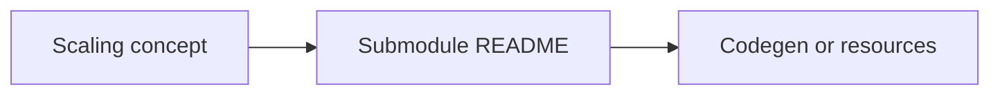

# Platform map and Android verification

English-only companion to the submodule READMEs. **Strategy names here are conceptual** until you paste the submodule API you integrate. Migrating unified Android labels (`FIXED / DEFAULT / BALANCED`): **[MIGRATION.md](MIGRATION.md)**.

Authoritative Compose math + prefix catalogue: **[`appdimens-dynamic/DOCUMENTATION/`](https://github.com/bodenberg/appdimens-dynamic/tree/main/DOCUMENTATION)** — [`MATHEMATICS-AND-CALCULUS.md`](https://github.com/bodenberg/appdimens-dynamic/blob/main/DOCUMENTATION/MATHEMATICS-AND-CALCULUS.md), [`README.md`](https://github.com/bodenberg/appdimens-dynamic/blob/main/DOCUMENTATION/README.md), [`COMPOSE-API-CONVENTIONS.md`](https://github.com/bodenberg/appdimens-dynamic/blob/main/DOCUMENTATION/COMPOSE-API-CONVENTIONS.md).

---

## Submodule status snapshot

Always reconfirm semver in the submodule README before pinning — this column is a coarse "production-ready?" indicator only.

| Submodule | Platform | Status |
|-----------|----------|--------|
| [`appdimens-dynamic`](https://github.com/bodenberg/appdimens-dynamic/tree/main) | Android (Compose + Kotlin + Java) | **Production** |
| [`appdimens-sdps`](https://github.com/bodenberg/appdimens-sdps/tree/main) | Android (XML + Compose) | **Production** |
| [`appdimens-ssps`](https://github.com/bodenberg/appdimens-ssps/tree/main) | Android (XML + Compose, text) | **Production** |
| [`appdimens-games`](https://github.com/bodenberg/appdimens-games/tree/main) | Android (Kotlin + NDK + OpenGL ES) | Work in progress |
| [`appdimens-ios`](https://github.com/bodenberg/appdimens-ios/tree/main) | iOS / macOS (UIKit + SwiftUI + Metal) | Work in progress |
| [`appdimens-dynamic-kmp`](https://github.com/bodenberg/appdimens-dynamic-kmp/tree/main) | Kotlin Multiplatform | Work in progress |
| [`appdimens-flutter`](https://github.com/bodenberg/appdimens-flutter/tree/main) | Flutter (Android / iOS / Web / desktop) | Work in progress |
| [`appdimens-react-native`](https://github.com/bodenberg/appdimens-react-native/tree/main) | React Native | Work in progress |
| [`appdimens-web`](https://github.com/bodenberg/appdimens-web/tree/main) | Web (vanilla / React / Vue / Svelte / Angular) | Work in progress |

---

## Concept → binding (all stacks)

Concrete syntax lives beside the source — not in this table. Snapshot for orientation only:

| Concept | Android Compose (`appdimens-dynamic`) | iOS (`AppDimens`) | Web (`webdimens`) | Flutter (`appdimens`) | React Native (`appdimens-react-native`) |
|---------|----------------------------------------|-------------------|-------------------|----------------------|----------------------------------------|
| Hybrid **BALANCED** curve | **`auto`** — `asdp`, `ahdp`, `awdp`, `assp`, … [`auto.md`](https://github.com/bodenberg/appdimens-dynamic/blob/main/DOCUMENTATION/auto.md) | `AppDimens.shared.balanced(_).toPoints()` | `balanced(_)` builder | `.fixed`, `.fx` per Flutter submodule | `balanced(_)` |
| SDP-style baseline (**DEFAULT / FIXED** narrative) | **`scaled`** — `sdp`, `wdp`, `hdp`, `ssp`, `sem`, … [`scaled.md`](https://github.com/bodenberg/appdimens-dynamic/blob/main/DOCUMENTATION/scaled.md) | Submodule README | `defaultScaling`-style helpers where published | Same fixed-style helpers | `defaultScaling(_)` |
| Logarithmic damping | Prefer explicit `logarithmic` or AR-aware `scaled` tokens — no mythical `defaultDp` | `defaultScaling`, `logarithmic` | `defaultScaling`, `logarithmic` | builder-specific | Helpers as exposed |
| **PERCENTAGE** / legacy **DYNAMIC** | **`percent`** — `psdp`, `pwdp`, `phdp`, … [`percent.md`](https://github.com/bodenberg/appdimens-dynamic/blob/main/DOCUMENTATION/percent.md) | `percentage(_)` | `percentage(_)` | Dynamic builders `.dy` | `percentage(_)` |
| Raw XML SDP/SSP | Separate artifacts `appdimens-sdps`, `appdimens-ssps` | — | — | — | — |
| Native games | [`appdimens-games`](https://github.com/bodenberg/appdimens-games/blob/main/appdimens_games/README.md) façade | submodule Metal layer | — | — | — |
| Builder **smart** chaining | Compose tree uses **explicit tokens** (`sdp`, `asdp`, …) — no fused `smart().forElement` | `.smart(_).forElement(_)` variants | Equivalent hooks where published | Equivalent hooks | Equivalent hooks |

---

## Physical units (mm / cm / inch) — across stacks

Real-world measurements where they matter (kiosks, AR, accessibility touch targets). Each cell links to the submodule entry point.

| Concept | Android Compose / `code` | iOS | Flutter | React Native | Web |
|---------|---------------------------|-----|---------|---------------|-----|
| Millimetres | `10.mm` (Compose); `DimenPhysicalUnits.toDpFromMm(10f)` ([`physical-units.md`](https://github.com/bodenberg/appdimens-dynamic/blob/main/DOCUMENTATION/physical-units.md)) | `AppDimensPhysicalUnits.mm(10)` | `AppDimensPhysicalUnits.mmToPixels(10, context)` | `physicalUnits.mm(10)` | `webdimens.mm(10)` |
| Centimetres | `8.cm` (Compose) | `AppDimensPhysicalUnits.cm(8)` | `AppDimensPhysicalUnits.cmToPixels(8, context)` | `physicalUnits.cm(8)` | `webdimens.cm(8)` |
| Inches | `5.inch` (Compose) | `AppDimensPhysicalUnits.inch(5)` | `AppDimensPhysicalUnits.inchToPixels(5, context)` | `physicalUnits.inch(5)` | `webdimens.inch(5)` |

The Android implementation uses `displayMetrics.xdpi` / `ydpi` — see [`physical-units.md`](https://github.com/bodenberg/appdimens-dynamic/blob/main/DOCUMENTATION/physical-units.md) for the formal definition and per-axis caveats.

**Sources of truth:** [`appdimens-dynamic` README](https://github.com/bodenberg/appdimens-dynamic/blob/main/README.md) · Flutter [`appdimens.dart`](https://github.com/bodenberg/appdimens-flutter/blob/main/lib/src/appdimens.dart) · Web [`WebDimensBuilder.ts`](https://github.com/bodenberg/appdimens-web/blob/main/src/core/WebDimensBuilder.ts) · RN [`AppDimensBuilder.ts`](https://github.com/bodenberg/appdimens-react-native/blob/main/src/core/AppDimensBuilder.ts) · iOS examples / [`USAGE_GUIDE.md`](https://github.com/bodenberg/appdimens-ios/blob/main/USAGE_GUIDE.md).

---

## `appdimens-dynamic` roster (Gradle strategy ↔ Compose import)

Older hub prose used ENUM-like headings. **`appdimens-dynamic`** implements each kernel as its own Gradle source package:

| Cross-platform wording | Gradle strategy | Compose import sketch | Doc |
|------------------------|----------------|------------------------|-----|
| **BALANCED** | `auto` | `com.appdimens.dynamic.compose.auto.*` | [`auto.md`](https://github.com/bodenberg/appdimens-dynamic/blob/main/DOCUMENTATION/auto.md) |
| **DEFAULT** / **FIXED** | `scaled` | `compose.scaled.*` (`sdp`, `wdp`, `hdp`, `ssp`) | [`scaled.md`](https://github.com/bodenberg/appdimens-dynamic/blob/main/DOCUMENTATION/scaled.md) |
| **PERCENTAGE** / legacy **DYNAMIC** | `percent` | `compose.percent.*` | [`percent.md`](https://github.com/bodenberg/appdimens-dynamic/blob/main/DOCUMENTATION/percent.md) |
| Steven’s law knob | `power` | `compose.power.*` | [`power.md`](https://github.com/bodenberg/appdimens-dynamic/blob/main/DOCUMENTATION/power.md) |
| Clamp / band typography | `fluid` | `compose.fluid.*` | [`fluid.md`](https://github.com/bodenberg/appdimens-dynamic/blob/main/DOCUMENTATION/fluid.md) |
| Weber–Fechner style | `logarithmic` | `compose.logarithmic.*` | [`logarithmic.md`](https://github.com/bodenberg/appdimens-dynamic/blob/main/DOCUMENTATION/logarithmic.md) |
| Blend vs linear | `interpolated` | `compose.interpolated.*` | [`interpolated.md`](https://github.com/bodenberg/appdimens-dynamic/blob/main/DOCUMENTATION/interpolated.md) |
| Hypotenuse feel | `diagonal` | `compose.diagonal.*` | [`diagonal.md`](https://github.com/bodenberg/appdimens-dynamic/blob/main/DOCUMENTATION/diagonal.md) |
| W+H pacing | `perimeter` | `compose.perimeter.*` | [`perimeter.md`](https://github.com/bodenberg/appdimens-dynamic/blob/main/DOCUMENTATION/perimeter.md) |
| Letterbox | `fit` | `compose.fit.*` | [`fit.md`](https://github.com/bodenberg/appdimens-dynamic/blob/main/DOCUMENTATION/fit.md) |
| Cover | `fill` | `compose.fill.*` | [`fill.md`](https://github.com/bodenberg/appdimens-dynamic/blob/main/DOCUMENTATION/fill.md) |
| Density knobs | `density` | `compose.density.*` | [`density.md`](https://github.com/bodenberg/appdimens-dynamic/blob/main/DOCUMENTATION/density.md) |
| Constraint resize | `resize` | `compose.resize.*`, `ResizeBound` | [`resize.md`](https://github.com/bodenberg/appdimens-dynamic/blob/main/DOCUMENTATION/resize.md) |
| **NONE** | — | Plain `Dp`/`Sp` or guard rails | — |

Prefix naming rules: [`COMPOSE-API-CONVENTIONS.md`](https://github.com/bodenberg/appdimens-dynamic/blob/main/DOCUMENTATION/COMPOSE-API-CONVENTIONS.md)

---

## Constants checked against Kotlin

Compared with [`DesignScaleConstants.kt`](https://github.com/bodenberg/appdimens-dynamic/blob/main/library/src/main/java/com/appdimens/dynamic/core/DesignScaleConstants.kt):

| Constant | Value | Meaning |
|-----------|-------|---------|
| `BASE_WIDTH_DP` | `300f` | Reference width denominator |
| `BASE_HEIGHT_DP` | `533f` | Companion height baseline |
| `REFERENCE_ASPECT_RATIO` | `1.78f` | AR normalization for multipliers |
| Diagonal baseline | `\sqrt{300^2+533^2} ≈ 611.63` dp | For diagonal strategy |
| Perimeter baseline | `833` dp | For perimeter strategy |
| `auto` hinge | measured axis `480` dp (`DimenAutoDp.kt`) | BALANCED narrative |
| `auto` ln gain | `0.4f` | Log damping coefficient |

Heavy linear algebra layouts live in **`MATHEMATICS-AND-CALCULUS.md` §§3–4**. Performance notes echo from submodule **`library/PERFORMANCE.md`**.

---

## `auto` (**BALANCED**) kernel recap

Kotlin path `calculateAutoDpCompose` (**`DimenAutoDp.kt`**) with **`inv = 1/300`**, **`transition = 480`**, **`sensitivity = 0.4`**:

1. If axis `dim ≤ 480 dp`: `scale = dim × inv` (linear segment identical to SDP thinking on phones).
2. If `dim > 480 dp`: `scale = transition·inv + sensitivity·ln(1 + (dim - transition)·inv)`.

Output before optional AR suffix **`a`** is `base × scale × (aspect ratio multiplier)`. Matches submodule **`DOCUMENTATION/auto.md`**.

---

## `scaled`, `percent`, Smart builders

**`scaled`:** Plain linear scale when AR compensation is OFF; **`f.arMultiplier`** path when documented suffixes flip AR on (**`scaled.md`**).

**`percent`:** Matches **`percent.md`** §4 matrices (axis dp × global inverse).

**Smart inference:** Kotlin **does not** ship `smart(...).forElement(...)` wrappers; other stacks may—keep Android guidance explicitly **strategy-per-call**. Strategy selection order summarized in **[README](../README.md)** (**scaled → percent → auto** when reading older tables).

Regression coverage: **`StrategyModuleFormulasTest.kt`** in `appdimens-dynamic` (**`MATHEMATICS-AND-CALCULUS.md` §6**).

---

## Cross-platform numeric parity (historical QA snapshot)

For the audited reference row **48 dp base on a ~720 dp-wide canvas**, stacks that shipped the canonical kernel landed within ~0.1 dp of each other:

| Platform family | Narrative curve | Result |
|-----------------|-----------------|--------|
| Audited snapshots (Android/iOS/Web/Flutter/RN) | Hybrid **BALANCED** | ~69.7 dp |
| Same cohort | Phone-first **DEFAULT** prose | ~79.2 dp |
| Same cohort | Proportional / axis-heavy storyline | ~115.2 dp |

Treat this as reassurance that narratives match reference implementations — not a pledge about every nightly build on every roadmap module. Always run your submodule tests before pinning.

---

## Sources of truth (per submodule)

When prose in this hub disagrees with the submodule, **the submodule wins**. Use this list when porting concepts, verifying signatures, or filing shipping bugs.

- **Android `appdimens-dynamic`** — [README](https://github.com/bodenberg/appdimens-dynamic/blob/main/README.md) · [`DOCUMENTATION/README.md`](https://github.com/bodenberg/appdimens-dynamic/blob/main/DOCUMENTATION/README.md) · [`MATHEMATICS-AND-CALCULUS.md`](https://github.com/bodenberg/appdimens-dynamic/blob/main/DOCUMENTATION/MATHEMATICS-AND-CALCULUS.md) · [`COMPOSE-API-CONVENTIONS.md`](https://github.com/bodenberg/appdimens-dynamic/blob/main/DOCUMENTATION/COMPOSE-API-CONVENTIONS.md) · [`PERFORMANCE.md`](https://github.com/bodenberg/appdimens-dynamic/blob/main/PERFORMANCE.md) · [`R8-PROGUARD.md`](https://github.com/bodenberg/appdimens-dynamic/blob/main/R8-PROGUARD.md)
- **Android `appdimens-sdps`** — [README](https://github.com/bodenberg/appdimens-sdps/blob/main/README.md)
- **Android `appdimens-ssps`** — [README](https://github.com/bodenberg/appdimens-ssps/blob/main/README.md)
- **Android `appdimens-games`** — [submodule root](https://github.com/bodenberg/appdimens-games/tree/main) · [`appdimens_games/`](https://github.com/bodenberg/appdimens-games/tree/main/appdimens_games)
- **Apple `appdimens-ios`** — [submodule root](https://github.com/bodenberg/appdimens-ios/tree/main) (UIKit + SwiftUI + Metal)
- **Kotlin Multiplatform `appdimens-dynamic-kmp`** — [submodule root](https://github.com/bodenberg/appdimens-dynamic-kmp/tree/main)
- **Flutter `appdimens-flutter`** — [submodule root](https://github.com/bodenberg/appdimens-flutter/tree/main) · `lib/src/`
- **React Native `appdimens-react-native`** — [submodule root](https://github.com/bodenberg/appdimens-react-native/tree/main) · `src/core/`
- **Web `webdimens`** — [submodule root](https://github.com/bodenberg/appdimens-web/tree/main) · `src/core/`

---

[← Documentation index](README.md) · [`appdimens-dynamic` README](https://github.com/bodenberg/appdimens-dynamic/blob/main/README.md) · [GUIDE](GUIDE.md) · [THEORY](THEORY.md) · [MIGRATION](MIGRATION.md) · [ORIENTATION](ORIENTATION.md)
