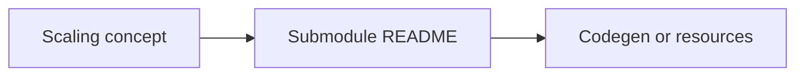

# Platform API Map (concept to bindings)

> **Hub documentation.** Version-agnostic. Strategy **names** are shared across docs; **public syntax** differs by submodule. Confirm tokens in the submodule README before copying snippets.

**Full Android ↔ synonym table (constants, formulae refs):** [IMPLEMENTATION_ALIGNMENT_APPDIMENS_DYNAMIC.md](IMPLEMENTATION_ALIGNMENT_APPDIMENS_DYNAMIC.md).

---

This hub names strategies (BALANCED, DEFAULT, PERCENTAGE, …). **Concrete APIs** ship in repositories linked from the **[main README submodule map](../README.md#submodule-map)**—not in this row.

Jetpack Compose for Android is implemented in **`appdimens-dynamic`** and typically does **not** mirror legacy unified chains such as `.balanced().dp` / `.defaultDp` from older tutorials—use submodule `DOCUMENTATION/` and Compose extensions instead.

See also [DOCS/README.md](README.md) for the conceptual index.

| Concept | Android — `appdimens-dynamic` (Compose) | iOS — `AppDimens` | Web — `webdimens` | Flutter — `appdimens` | React Native — `appdimens-react-native` |
|---------|----------------------------------------|-------------------|-------------------|----------------------|----------------------------------------|
| **Primary balanced hybrid** (linear then compressed growth on larger axes) | **Auto** axis tokens: `asdp` / `ahdp` / `awdp`, `assp`, … (`import com.appdimens.dynamic.compose.auto.*`). See [auto.md](../appdimens-dynamic/DOCUMENTATION/auto.md). | `AppDimens.shared.balanced(_).toPoints()` (verify in submodule examples). | `useWebDimens()` → `balanced(_)` on `WebDimensBuilder` ([WebDimensBuilder.ts](../appdimens-web/src/core/WebDimensBuilder.ts)). | `AppDimens.fixed(...)`, `.fx`, builder `.calculate(context)`—see [appdimens.dart](../appdimens-flutter/lib/src/appdimens.dart). | `useAppDimens()` → `balanced(_)` ([AppDimensBuilder.ts](../appdimens-react-native/src/core/AppDimensBuilder.ts)). |
| **Scaled default** (`sdp`-style axes) | `16.sdp`, `100.wdp`, `48.hdp`, `16.ssp`, … (`import com.appdimens.dynamic.compose.*`). | iOS builders—see submodule. | Helpers on web builder | `AppDimens.fixed` / `.fx` per Flutter submodule | Builders + `defaultScaling` helpers |
| **DEFAULT / logarithmic-heavy paths** | Choose explicit strategy modules (`compose.logarithmic`, etc.)—see submodule `DOCUMENTATION/`. No single `defaultDp` token guarantees parity with other platforms. | `AppDimens.shared.defaultScaling(_).toPoints()` | `defaultScaling(_)` | Fixed-style builders (`AppDimens.fixed`) | `defaultScaling(_)` |
| **PERCENTAGE / proportional** | `compose.percent`, width-heavy `wdp` patterns—follow submodule README. | `AppDimens.shared.percentage(_).toPoints()` | `percentage(_)` | Dynamic builders / `.dy` ([appdimens_dynamic.dart](../appdimens-flutter/lib/src/appdimens_dynamic.dart)) | `percentage(_)` |
| **XML-only SDP/SSP** | `appdimens-sdps`, `appdimens-ssps` (`@dimen/_*sdp`, `@dimen/_*ssp`) — separate artifacts. | — | — | — | — |
| **Games / native runtime** | `appdimens-games` C++/Kotlin façade ([README](../appdimens-games/appdimens_games/README.md)). | Submodule notes for Metal/game paths where present. | — | — | — |
| **Smart / element-aware inference** | Android dynamic tree may omit `smart()` style chains shown in docs for web/iOS/RN—**verify Kotlin sources.** | `.smart(...).forElement(...)` variants | Equivalent builder hooks | Check Flutter submodule | Equivalent hooks |

---

**Upstream sources of truth**

- Android Compose: [appdimens-dynamic/README.md](../appdimens-dynamic/README.md), [DOCUMENTATION/README.md](../appdimens-dynamic/DOCUMENTATION/README.md)
- Flutter: [appdimens.dart](../appdimens-flutter/lib/src/appdimens.dart)
- Web: [WebDimensBuilder.ts](../appdimens-web/src/core/WebDimensBuilder.ts)
- React Native: [AppDimensBuilder.ts](../appdimens-react-native/src/core/AppDimensBuilder.ts)
- iOS: `appdimens-ios/Examples`, `USAGE_GUIDE.md`

[Back to documentation index](README.md)
