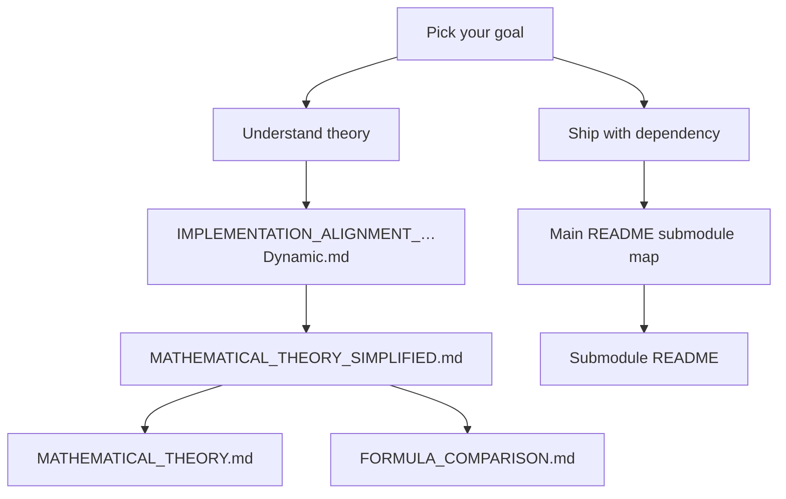

# AppDimens — Theory & Concept Index

> **Hub documentation.** This section is **version-agnostic conceptual reference**. It does not pin library versions, semver, or install commands—for those, open the **[platform submodule README](../README.md#submodule-map)** you depend on (`appdimens-dynamic`, `appdimens-ios`, `webdimens`, …).

> **Validated Android math & names:** When you implement in **Kotlin / Jetpack Compose**, treat **[`IMPLEMENTATION_ALIGNMENT_APPDIMENS_DYNAMIC.md`](IMPLEMENTATION_ALIGNMENT_APPDIMENS_DYNAMIC.md)** as the glossary that ties **conceptual strategy labels** (**BALANCED**, **DEFAULT**, …) to the **actual submodule packages** (**auto**, **scaled**, **percent**, …) that ship in **`appdimens-dynamic`**.

---

## Phase 10 — Hub consistency sweep (maintainers)

After any large edit to theory, examples, or comparisons, run the **Phase 10** pass so Android naming stays aligned with **`appdimens-dynamic`**:

1. **[`DOCUMENTATION_REVIEW_CHECKLIST.md`](DOCUMENTATION_REVIEW_CHECKLIST.md)** — work through every checkbox.
2. **Grep the hub (not submodules)** for drift, e.g. `LANG/`, pinned coordinates in `DOCS/`, and **Kotlin samples that label `sdp`/`ssp` as “BALANCED”** (should be **`asdp`/`assp`** or an explicit “`scaled` only” note).
3. Reconcile math and tokens with **[`IMPLEMENTATION_ALIGNMENT_APPDIMENS_DYNAMIC.md`](IMPLEMENTATION_ALIGNMENT_APPDIMENS_DYNAMIC.md)** and submodule **[`MATHEMATICS-AND-CALCULUS.md`](../appdimens-dynamic/DOCUMENTATION/MATHEMATICS-AND-CALCULUS.md)**.

---

## What belongs in this hub

| Content | Lives here (`DOCS/`) | Lives in submodules |
|---------|---------------------|---------------------|
| Scaling strategy intuition | Yes | Thin pointer |
| Verified formulas vs **Android Dynamic** runtime | **`IMPLEMENTATION_ALIGNMENT_APPDIMENS_DYNAMIC.md`** + links into [`appdimens-dynamic/DOCUMENTATION/`](../appdimens-dynamic/DOCUMENTATION/README.md) | Source of truth for constants & kernels |
| Build coordinates & APIs | No | Submodule README |

---

## Where to read first

1. **[Main hub README](../README.md)** — production vs work-in-progress modules  
2. **[Android alignment sheet](IMPLEMENTATION_ALIGNMENT_APPDIMENS_DYNAMIC.md)** — terminology ↔ `appdimens-dynamic` facts  
3. **[Quick reference](DOCS_QUICK_REFERENCE.md)**  
4. **[Simplified theory](MATHEMATICAL_THEORY_SIMPLIFIED.md)**  
5. **[Examples](EXAMPLES.md)** *(illustrative only)*  

---

## Core theory

| Document | Audience |
|----------|----------|
| [MATHEMATICAL_THEORY_SIMPLIFIED.md](MATHEMATICAL_THEORY_SIMPLIFIED.md) | Intuitive pass |
| [MATHEMATICAL_THEORY.md](MATHEMATICAL_THEORY.md) | Full derivations & strategy catalog prose |
| [FORMULA_COMPARISON.md](FORMULA_COMPARISON.md) | Side-by-side discussion |
| [IMPLEMENTATION_ALIGNMENT_APPDIMENS_DYNAMIC.md](IMPLEMENTATION_ALIGNMENT_APPDIMENS_DYNAMIC.md) | **Kotlin reference alignment** |

---

## Application guidance

| Document | Topic |
|----------|-------|
| [COMPREHENSIVE_TECHNICAL_GUIDE.md](COMPREHENSIVE_TECHNICAL_GUIDE.md) | Long-form narrative across stacks |
| [APPLICABILITY_OF_APPDIMENS.md](APPLICABILITY_OF_APPDIMENS.md) | When AppDimens helps |
| [BASE_ORIENTATION_GUIDE.md](BASE_ORIENTATION_GUIDE.md) | Base orientation semantics |
| [VALIDATION_REPORT.md](VALIDATION_REPORT.md) | Methodological notes |
| [DOCUMENTATION_REVIEW_CHECKLIST.md](DOCUMENTATION_REVIEW_CHECKLIST.md) | Maintainer checklist |
| [PLATFORM_API_MAP.md](PLATFORM_API_MAP.md) | Concepts → submodule bindings |

---

## Interactive & visual assets

| Resource | Description |
|----------|--------------|
| [html/README.md](html/README.md) | Static HTML scaling comparisons |
| [../IMAGES/README.md](../IMAGES/README.md) | Raster gallery |
| [PDFs in `DOCS/`](AppDimens_Precision_Scaling.pdf) | Deep-dive publications |
| [README visual resources](../README.md#visual-resources) | One-click shields + thumbnails |

---

## Scaling strategies (conceptual)

Cross-platform prose often uses thirteen **concept buckets**. **`appdimens-dynamic`** expresses them with lowercase **strategy packages**: `scaled`, `percent`, `power`, `fluid`, `auto`, plus `diagonal`, `fill`, `fit`, `interpolated`, `logarithmic`, `perimeter`, `density`, and the separate **`resize`** subsystem (constraint-based sizing). See the alignment sheet for synonym mapping.

Formal math for Android kernels: **[`MATHEMATICS-AND-CALCULUS.md`](../appdimens-dynamic/DOCUMENTATION/MATHEMATICS-AND-CALCULUS.md)**.

---

## Submodule documentation layout

- **Android (Compose)** → `appdimens-dynamic/DOCUMENTATION/`  
- **Android SDP/SSP** → `appdimens-sdps`, `appdimens-ssps`  
- Other stacks → folders linked from **[`README.md`](../README.md)**  

---

[↑ Main README](../README.md) · [Alignment (Android Dynamic)](IMPLEMENTATION_ALIGNMENT_APPDIMENS_DYNAMIC.md) · [Examples](EXAMPLES.md) · [Phase 10 sweep](#phase-10--hub-consistency-sweep-maintainers)

