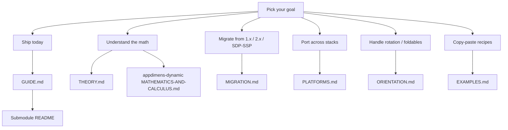

# AppDimens documentation hub

This folder explains **ideas, vocabulary, and the mathematical theory** shared across every AppDimens platform library. It is **theory-only**: no semver, no install lines, no platform-specific build configuration. **Submodule READMEs remain the authority** for pinned versions, Gradle / npm / Swift / pub manifests, and exact API signatures.

> [!NOTE]
> **What this folder is**
>
> - Shared **vocabulary** (BALANCED, DEFAULT, PERCENTAGE, …) and how it maps onto each stack's tokens.
> - Formal **mathematics** of every kernel (formulas, constants, invariants). **[THEORY.md](THEORY.md)** is tuned for [GitHub’s math renderer](https://docs.github.com/en/get-started/writing-on-github/working-with-advanced-formatting/writing-mathematical-expressions) (KaTeX subset); the submodule [MATHEMATICS-AND-CALCULUS.md](../appdimens-dynamic/DOCUMENTATION/MATHEMATICS-AND-CALCULUS.md) may use richer LaTeX.
> - **Migration paths** between AppDimens versions and from third-party libraries.
> - Cross-platform **API mapping** and orientation semantics.
>
> **What it is not** — install lines, version numbers, or production build advice. Those live with the source code, in the submodule README you ship.

**Android Compose naming reminder:** conceptual **BALANCED** is published as Gradle strategy **`auto`** (tokens `asdp`, `assp`, `ahdp`, `awdp`, …); **DEFAULT / FIXED** is **`scaled`** (`sdp`, `ssp`, `wdp`, `hdp`, `sem`, …); **PERCENTAGE / DYNAMIC** is **`percent`** (`psdp`, …). The complete mapping lives in [MIGRATION.md](MIGRATION.md), [PLATFORMS.md](PLATFORMS.md), and the canonical submodule reference [`appdimens-dynamic/DOCUMENTATION/MATHEMATICS-AND-CALCULUS.md`](../appdimens-dynamic/DOCUMENTATION/MATHEMATICS-AND-CALCULUS.md).

---

## Choose your learning path

| If your goal is… | Start here | Then go to |
|------------------|-----------|------------|
| **Ship today.** Pick a strategy, write some code, move on. | [GUIDE.md](GUIDE.md) — decision tree, FAQs, common patterns | Submodule README for your stack |
| **Understand the math.** Why these kernels? What are the formulas and invariants? | [THEORY.md](THEORY.md) — formal taxonomy, axioms, comparisons | [`MATHEMATICS-AND-CALCULUS.md`](../appdimens-dynamic/DOCUMENTATION/MATHEMATICS-AND-CALCULUS.md) |
| **Migrate** from 1.x / 2.x (unified DSL, `.fxdp`, `.dydp`) or from SDP/SSP | [MIGRATION.md](MIGRATION.md) — legacy ↔ Compose 3.x packages | The submodule changelog you ship |
| **Port** across Android / iOS / KMP / Flutter / RN / Web | [PLATFORMS.md](PLATFORMS.md) — concept ↔ submodule API, verified constants | The matching submodule README |
| **Rotate / foldable** your UI without proportion drift | [ORIENTATION.md](ORIENTATION.md) — base orientation + inverter tokens | [`COMPOSE-API-CONVENTIONS.md`](../appdimens-dynamic/DOCUMENTATION/COMPOSE-API-CONVENTIONS.md) |
| **Copy-paste recipes** per stack | [EXAMPLES.md](EXAMPLES.md) — long-form snippets | The submodule's `app/` sample where available |

The repository **[root README](../README.md)** answers the higher-level questions (*what is AppDimens? what problem does it solve? why pick it? where do I install?*) and routes here for theory and there for code.

---

## Document map

| File | Audience | What you'll find |
|------|----------|-------------------|
| [THEORY.md](THEORY.md) | Engineers / academics | Formal kernel taxonomy, axioms, formulas, AR multiplier, numerical comparisons, references |
| [GUIDE.md](GUIDE.md) | Day-to-day developers | Decision tree, troubleshooting, strategy-per-use-case patterns |
| [EXAMPLES.md](EXAMPLES.md) | Developers shipping a screen | Copy-paste recipes per platform (Android, iOS, Flutter, RN, Web) |
| [MIGRATION.md](MIGRATION.md) | Teams upgrading from 1.x / 2.x / SDP-SSP | Legacy naming ↔ `appdimens-dynamic` 3.x cheat sheet |
| [PLATFORMS.md](PLATFORMS.md) | Cross-platform / design-system maintainers | Concept ↔ API map across all stacks, verified Kotlin constants |
| [ORIENTATION.md](ORIENTATION.md) | Designers / engineers handling rotation | Base orientation, axis inverters, foldable semantics |
| [html/](html/) | Visual learners | Interactive scaling comparison pages |
| [`*.pdf`](.) | Slide-deck consumers | Precision-scaling whitepapers and visual reports |

Static and interactive visual assets live under **[html/](html/README.md)** and the PDF essays in this same folder. Raster comparisons: **[`../IMAGES/README.md`](../IMAGES/README.md)**.

---

## Glossary

Quick definitions for the terms that recur across every file in this folder.

| Term | Meaning |
|------|---------|
| **Hub label** | Stack-neutral name used in this folder (BALANCED, DEFAULT, PERCENTAGE, DYNAMIC). |
| **Kernel** | The 1-D map `f_S(b, c)` that turns a base value `b` into an output, given a `Configuration` `c`. Each kernel has a name and an entry in [`appdimens-dynamic/DOCUMENTATION/`](../appdimens-dynamic/DOCUMENTATION/). |
| **`auto` / BALANCED** | Hybrid kernel: linear for axes ≤ 480 dp, logarithmic above. The recommended primary for multi-form-factor apps. ([`auto.md`](../appdimens-dynamic/DOCUMENTATION/auto.md)) |
| **`scaled` / DEFAULT / FIXED** | Linear-proportional kernel anchored at 300 dp. The SDP-style baseline. ([`scaled.md`](../appdimens-dynamic/DOCUMENTATION/scaled.md)) |
| **`percent` / PERCENTAGE / DYNAMIC** | Axis-heavy proportional kernel. ([`percent.md`](../appdimens-dynamic/DOCUMENTATION/percent.md)) |
| **SDP** | Scalable density-independent pixel. Pre-computed `@dimen/_*sdp` resources in [`appdimens-sdps`](../appdimens-sdps/). |
| **SSP** | Scalable sp (text equivalent). Pre-computed `@dimen/_*ssp` in [`appdimens-ssps`](../appdimens-ssps/). |
| **Hinge** | The axis-dp threshold where the `auto` kernel switches from linear to logarithmic. Constant: **480 dp**. |
| **AR multiplier** | The optional aspect-ratio compensation referenced to 16:9 (AR = 1.78). Folded in by the `a` suffix on Compose tokens (`16.sdpa`, `16.asdpa`, …) and by builder options on iOS / Flutter / RN / Web. ([THEORY.md §4](THEORY.md#4-the-aspect-ratio-mould-the-optional-a-suffix)) |
| **Inverter** | A token suffix (`Ph`, `Lw`, `Lh`) that swaps the driving axis based on current orientation, so portrait-authored designs survive landscape rotation. ([ORIENTATION.md](ORIENTATION.md)) |
| **Qualifier** | A `DpQualifier` (`SMALLEST_WIDTH`, `SCREEN_WIDTH`, `SCREEN_HEIGHT`) used by `*Qualifier` facilitators to override sizing per breakpoint. |
| **Fast bypass** | Optimization where simple no-AR kernels (`scaled`, `auto`, `percent`, `fluid`) skip the cache and compute a 2 ns multiply directly. ([`appdimens-dynamic/PERFORMANCE.md`](../appdimens-dynamic/PERFORMANCE.md)) |

---

[← Root README](../README.md) · [Guide](GUIDE.md) · [Theory](THEORY.md) · [Examples](EXAMPLES.md) · [Migration](MIGRATION.md) · [Platforms](PLATFORMS.md) · [Orientation](ORIENTATION.md)

