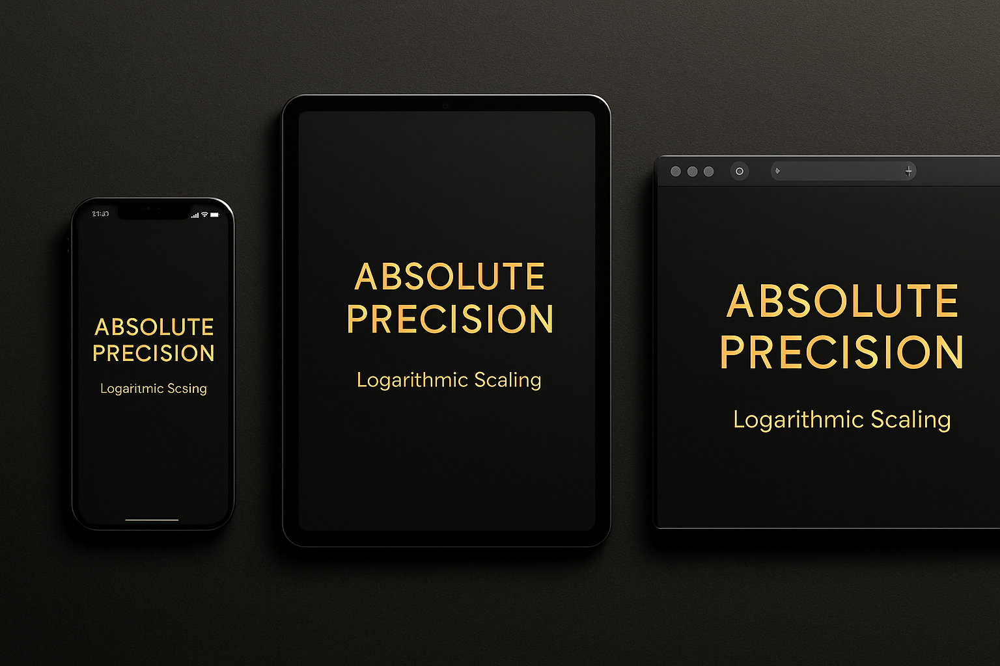
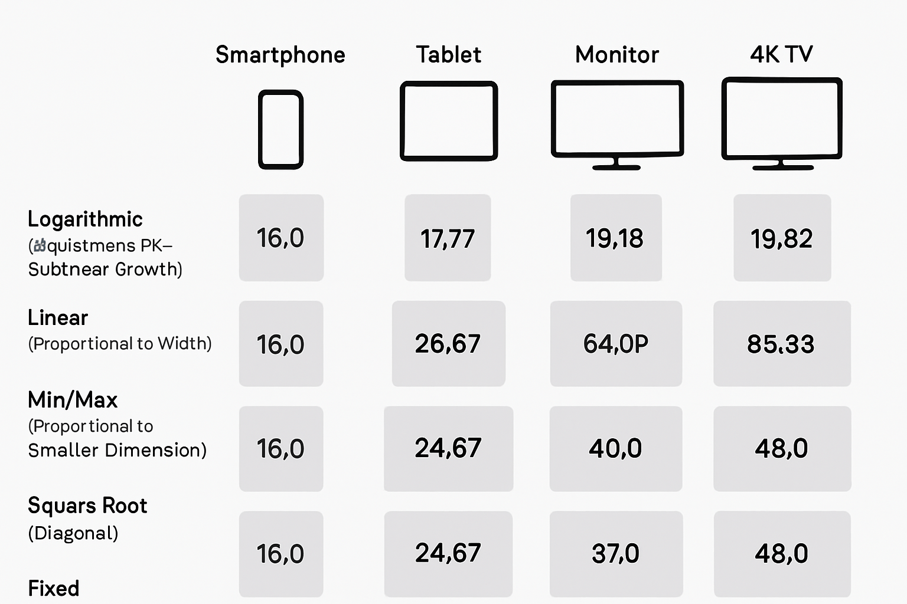
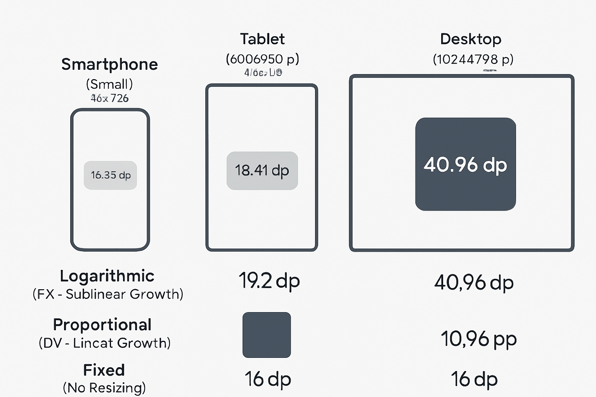
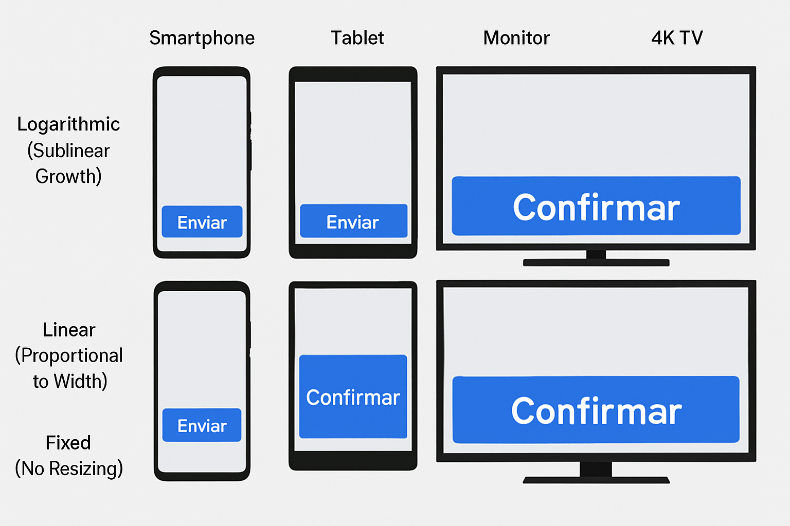
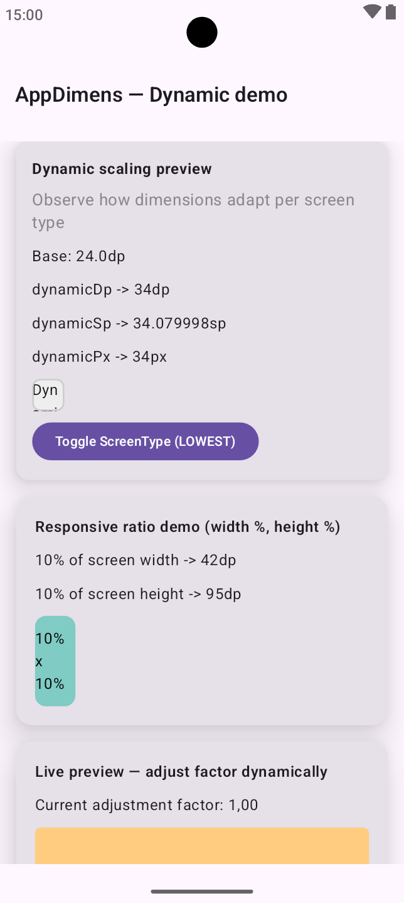
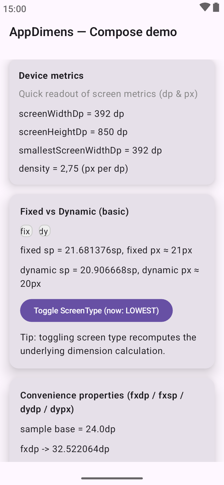
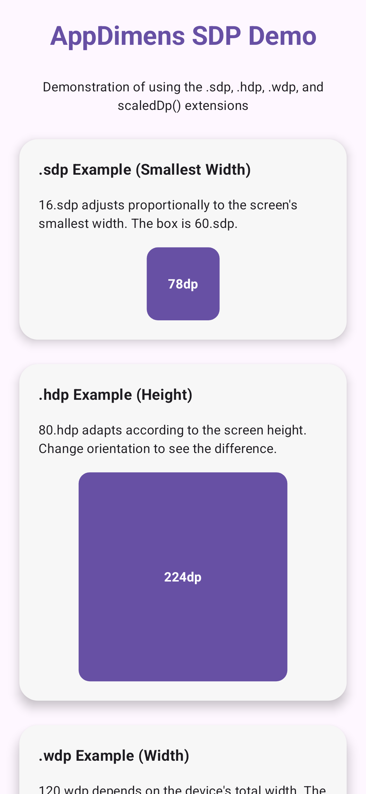

# Image gallery (documentation hub assets)

PNG files live in this folder for the **`appdimens` meta-repository** only. Screenshots shipped by platform libraries appear in submodule repos.

Interactive PDFs live under [`DOCS/`](../DOCS/) and thumbnails also appear near the footer of **[`README.md`](../README.md#visual-resources)**.

---

## Hero & mockups

| Preview | Caption |
|---------|---------|
|  | Collage illustrating responsive layouts across phones, tablets, and desktop form factors |
|  | Premium mock-style hero used in marketing-ready presentations |
|  | Main AppDimens wordmark badge |
|  | Android **dynamic** Compose family visual |

---

## Scaling strategy comparisons

| Preview | Caption |
|---------|---------|
|  | Side-by-side curve comparison for adaptive sizing |
|  | Extended comparison chart (alternate framing) |
|  | Button hit-target comparison across densities |
|  | Visual metaphor for aggressively adaptive (“dynamic”) growth |
|  | Visual metaphor for conservative / telephone-first scaling |

---

## Per-library badges (SDP / SSP)

| Preview | Caption |
|---------|---------|
|  | Scalable density-independent pixels (SDP) motif |
|  | Scalable scalable pixels (SSP) typography motif |
|  | AppDimens **SDP** product tile |
|  | AppDimens **SSP** product tile |

---

[← Back to main README](../README.md) · [Theory index](../DOCS/README.md) · [HTML demos](../DOCS/html/README.md)
