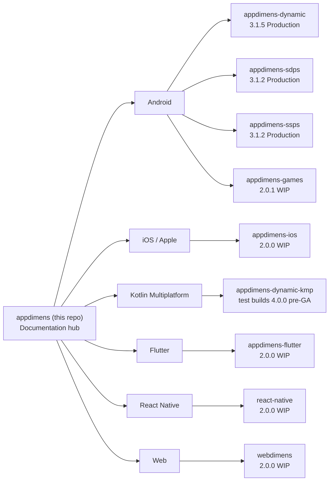

<div align="center">
   
<h1>AppDimens Hub</h1>
<p><strong>Meta-repo: theory + links to platform code</strong></p>

[](https://github.com/bodenberg/appdimens)
[](LICENSE)
[](https://github.com/bodenberg/appdimens)

[Docs index](DOCS/README.md) · [Quick reference](DOCS/DOCS_QUICK_REFERENCE.md) · [Naming 1.x/2.x→3.x](DOCS/NAMING_AND_MIGRATION_1X_2X_TO_3X.md) · [Technical guide](DOCS/COMPREHENSIVE_TECHNICAL_GUIDE.md)
</div>

Concepts: **[DOCS/](DOCS/README.md)**. **Artifacts & coords:** each **[submodule](.gitmodules)** — clone with **`--recurse-submodules`** and pin versions from **that README**.

---

## Quick start ⚡

```bash
git clone --recurse-submodules https://github.com/bodenberg/appdimens.git
cd appdimens && git submodule update --init --recursive
```

Need a single stack only? Clone [the matching upstream](https://github.com/bodenberg?tab=repositories&q=appdimens) instead of this umbrella.

---

## Status legend

| | |
|--|--|
| **Production** | OK to adopt for apps **after** pinning coordinates from the **submodule** README/build file. |
| **Work in progress** | Incomplete or preview-quality; evaluate before shipping. |

---

## Submodule map

Standalone repos (folder = submodule in this clone). **Confirm semver in the submodule** before pinning.

| Submodule | Platform | Coordinate (snapshot) | Status |
|-----------|----------|----------------------|--------|
| [appdimens-dynamic/](appdimens-dynamic/) | Android (Compose, Kotlin/Java) | `io.github.bodenberg:appdimens-dynamic:3.1.5` | Production |
| [appdimens-sdps/](appdimens-sdps/) | Android XML `@dimen/_*sdp` | `io.github.bodenberg:appdimens-sdps:3.1.2` | Production |
| [appdimens-ssps/](appdimens-ssps/) | Android XML `@dimen/_*ssp` | `io.github.bodenberg:appdimens-ssps:3.1.2` | Production |
| [appdimens-games/](appdimens-games/) | Games (Kotlin + NDK) | `…appdimens-games:2.0.1` | Work in progress |
| [appdimens-ios/](appdimens-ios/) | Apple platforms | CocoaPods SPM `2.0.0` (see submodule) | Work in progress |
| [appdimens-dynamic-kmp/](appdimens-dynamic-kmp/) | Kotlin Multiplatform | **Test:** `…appdimens-dynamic:4.0.0` — not GA · first stable KMP tracked as **1.0.0** | Work in progress |
| [appdimens-flutter/](appdimens-flutter/) | Flutter | `appdimens: ^2.0.0` | Work in progress |
| [appdimens-react-native/](appdimens-react-native/) | React Native | `appdimens-react-native@2.0.0` | Work in progress |
| [appdimens-web/](appdimens-web/) | Web | `webdimens@2.0.0` | Work in progress |

**KMP:** same artifact ID as Android but **different publication** — do not mix blindly with Android **3.1.x**. Details: [appdimens-dynamic-kmp/](appdimens-dynamic-kmp/).

**GitHub mirrors:** [dynamic](https://github.com/bodenberg/appdimens-dynamic) · [kmp](https://github.com/bodenberg/appdimens-dynamic-kmp) · [sdps](https://github.com/bodenberg/appdimens-sdps) · [ssps](https://github.com/bodenberg/appdimens-ssps) · [games](https://github.com/bodenberg/appdimens-games) · [flutter](https://github.com/bodenberg/appdimens-flutter) · [ios](https://github.com/bodenberg/appdimens-ios) · [react-native](https://github.com/bodenberg/appdimens-react-native) · [web](https://github.com/bodenberg/appdimens-web)

---

## Install snippets 📦

Convenience only—**canonical lines live in each submodule README.**

### Android — `appdimens-dynamic` (Production)

Compose / Kotlin calculators: `sdp`, `wdp`, `hdp`, `ssp`, `asdp`, …  
→ **[appdimens-dynamic/README.md](appdimens-dynamic/README.md)**

```kotlin
dependencies {
    implementation("io.github.bodenberg:appdimens-dynamic:3.1.5")
}
```

### Android — `appdimens-sdps` & `appdimens-ssps` (Production)

→ **[appdimens-sdps/README.md](appdimens-sdps/README.md)** · **[appdimens-ssps/README.md](appdimens-ssps/README.md)**

```kotlin
implementation("io.github.bodenberg:appdimens-sdps:3.1.2")
implementation("io.github.bodenberg:appdimens-ssps:3.1.2")
```

### Android — `appdimens-games` (WIP)

→ **[appdimens-games/appdimens_games/README.md](appdimens-games/appdimens_games/README.md)**

```kotlin
implementation("io.github.bodenberg:appdimens-games:2.0.1")
```

### iOS — `appdimens-ios` (WIP)

→ **[INSTALLATION.md](appdimens-ios/INSTALLATION.md)**

```ruby
pod 'AppDimens', '~> 2.0.0'
```

### Kotlin Multiplatform — `appdimens-dynamic-kmp` (WIP, test line)

→ **[appdimens-dynamic-kmp/README.md](appdimens-dynamic-kmp/README.md)**

```kotlin
// Test/pre-production coordinate — not stabilized GA for KMP.
implementation("io.github.bodenberg:appdimens-dynamic:4.0.0")
```

### Flutter (WIP)

→ **[appdimens-flutter/README.md](appdimens-flutter/README.md)**

```yaml
dependencies:
  appdimens: ^2.0.0
```

### React Native (WIP)

→ **[appdimens-react-native/README.md](appdimens-react-native/README.md)**

```bash
npm install appdimens-react-native@2.0.0
```

### Web (WIP)

→ **[appdimens-web/README.md](appdimens-web/README.md)**

```bash
npm install webdimens@2.0.0
```

---

## Compose 3.x — three names that matter

| You read / old samples | Package in **3.x** | Tokens (examples) |
|------------------------|--------------------|-------------------|
| **BALANCED** | `auto` | `asdp`, `assp` |
| **FIXED** + **DEFAULT** | `scaled` | `sdp`, `ssp`, `wdp` |
| **DYNAMIC** + **PERCENTAGE** | `percent` | `psdp`, … |

Full migration: **[DOCS/NAMING_AND_MIGRATION_1X_2X_TO_3X.md](DOCS/NAMING_AND_MIGRATION_1X_2X_TO_3X.md)** · constants & kernels: **[DOCS/IMPLEMENTATION_ALIGNMENT_APPDIMENS_DYNAMIC.md](DOCS/IMPLEMENTATION_ALIGNMENT_APPDIMENS_DYNAMIC.md)**

---

## Docs in this hub 📚

| | |
|--|--|
| [DOCS/README.md](DOCS/README.md) | Theory index |
| [DOCS/EXAMPLES.md](DOCS/EXAMPLES.md) | Patterns (confirm against submodule) |
| [DOCS/IMPLEMENTATION_ALIGNMENT_APPDIMENS_DYNAMIC.md](DOCS/IMPLEMENTATION_ALIGNMENT_APPDIMENS_DYNAMIC.md) | Android alignment |
| [DOCS/NAMING_AND_MIGRATION_1X_2X_TO_3X.md](DOCS/NAMING_AND_MIGRATION_1X_2X_TO_3X.md) | 1.x/2.x → 3.x naming |
| [DOCS/BASE_ORIENTATION_GUIDE.md](DOCS/BASE_ORIENTATION_GUIDE.md) | Orientation / rotation |
| [DOCS/html/](DOCS/html/) | Static HTML comparisons |
| [IMAGES/README.md](IMAGES/README.md) | Image gallery |

---

## More context

Optional *why*—the sections above are enough to ship code.

### What this repository is

| Layer | Role |
|-------|------|
| **Hub** (`DOCS/`) | Strategy theory—no semver pins inside theory folders. |
| **Submodules** | Source releases, Gradle/npm/pod instructions, changelog. |

### Problem & approach

Raw **dp/sp** track density but not **how UI should scale** across form factors and aspect ratios. AppDimens uses **named strategies** (hybrids, perceptual curves, fluid bounds, game modes, …). Theory: **[DOCS/](DOCS/README.md)** · code: **submodules**.

### Hub vs platform



### 13 strategies (skim)

Android packages stay lowercase (`scaled`, `percent`, `auto`, …). Full write-ups: [Simplified](DOCS/MATHEMATICAL_THEORY_SIMPLIFIED.md) · [Full](DOCS/MATHEMATICAL_THEORY.md) · [Compare](DOCS/FORMULA_COMPARISON.md).

| Strategy | Typical use |
|----------|-------------|
| **BALANCED (`auto`)** | Multi-form-factor default |
| **DEFAULT & FIXED (`scaled`)** | SDP-style baseline |
| **PERCENTAGE & DYNAMIC (`percent`)** | Strong proportion on an axis |
| **LOGARITHMIC**, **POWER** | TV / perceptual control |
| **FLUID** | Bounded type & spacing |
| **INTERPOLATED**, **DIAGONAL**, **PERIMETER** | Geometry-aware |
| **FIT**, **FILL** | Games |
| **AUTOSIZE** | Container fit |
| **NONE** | No scaling |

---

## Visual resources

**PDF** — [Precision scaling](DOCS/AppDimens_Precision_Scaling.pdf) · [Android](DOCS/AppDimens_Precision_Android_Scaling.pdf) · [UI](DOCS/AppDimens_Precision_UI_Scaling.pdf) · [Beyond DP](DOCS/Beyond_DP_Scaling.pdf)

**HTML** — [Complete comparison](DOCS/html/SCALING_COMPARISON_COMPLETE.html) · [Dynamic vs fixed](DOCS/html/SCALING_COMPARISON_2.html)

**Images** — [Gallery](IMAGES/README.md)

*Tip: open [`DOCS/html/`](DOCS/html/README.md) locally if GitHub preview blocks scripts.*

---

## Contributing & legal

**Language:** English in this hub; submodules may ship other locales.

- [CONTRIBUTING.md](CONTRIBUTING.md) · [SECURITY.md](SECURITY.md) · [CODE_OF_CONDUCT.md](CODE_OF_CONDUCT.md) · [CHANGELOG.md](CHANGELOG.md) · [LICENSE](LICENSE)

Hub issues: [here](https://github.com/bodenberg/appdimens/issues). **Runtime bugs** → file in the **submodule** you use.

---

## Author

**Jean Bodenberg** — [@bodenberg](https://github.com/bodenberg) · [appdimens-project.web.app](https://appdimens-project.web.app/)

---

<div align="center">

[Documentation](DOCS/README.md) · [Examples](DOCS/EXAMPLES.md) · [Technical guide](DOCS/COMPREHENSIVE_TECHNICAL_GUIDE.md)

</div>
