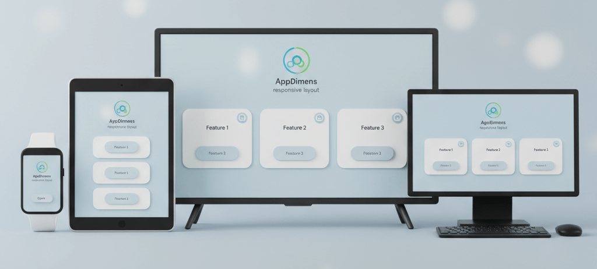
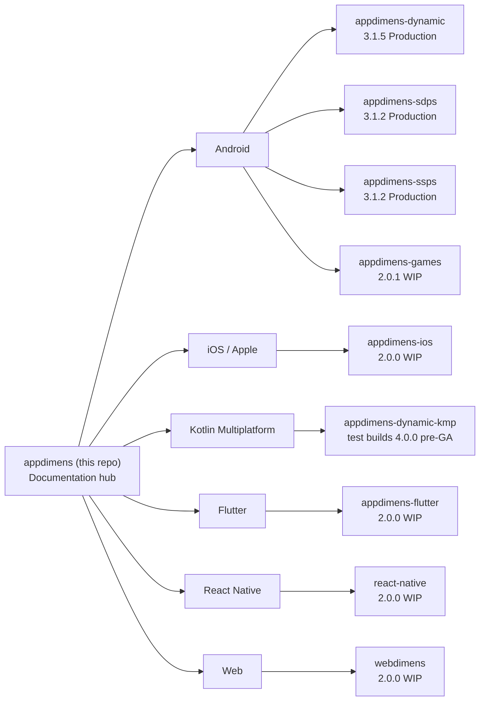

<div align="center">
   
<h1>AppDimens Hub</h1>
<p><strong>Documentation hub and meta-repository for the AppDimens multi-platform library family</strong></p>

[](https://github.com/bodenberg/appdimens)
[](LICENSE)
[](https://github.com/bodenberg/appdimens)

[Documentation index](DOCS/README.md) · [Quick reference](DOCS/DOCS_QUICK_REFERENCE.md) · [Technical guide](DOCS/COMPREHENSIVE_TECHNICAL_GUIDE.md)
</div>

> This repository **does not** ship application code as a single installable artifact. It is a **documentation hub**: theory in [`DOCS/`](DOCS/), platform code and Maven/npm/pub coordinates in **[Git submodules](.gitmodules)** (clone with `--recurse-submodules`). For install pins and API details, follow the README of the submodule you depend on.

**Language:** English only in this hub. Submodule repos may ship additional locales.

---

## Status legend

| Symbol | Meaning |
|--------|---------|
| **Production** | Published line intended for dependency use in apps; submodule README carries setup and versioning. Hub status is informational—**pin coordinates from the submodule** before release. |
| **Work in progress** | Incomplete surface, placeholders, or active iteration; submodule may still publish preview builds—evaluate before adopting. |

---

## What this repository is

This is the central **meta-repository** for AppDimens. It holds:

- **Theory and concepts** → [`DOCS/`](DOCS/README.md) (version-agnostic, no dependency coordinates).
- **Platform implementations** → each lives in its **own GitHub repository**, linked here as **[submodules](.gitmodules)** (same folder names as on GitHub).

```bash
git clone --recurse-submodules https://github.com/bodenberg/appdimens.git
git submodule update --init --recursive
```

If you need only one platform, clone **[that submodule’s upstream URL](https://github.com/bodenberg?tab=repositories&q=appdimens)** directly or open its folder here after cloning.

---

## Problem statement

Static **dp**, **sp**, **pt**, and **px** scale with density classes but rarely encode **how a layout should evolve** across:

- Phones vs tablets vs foldables vs TVs vs watches  
- Aspect ratios (ultra-wide, letterboxed, notch / island)  
- Web viewports vs native chrome  

Teams often compensate with brittle `values-sw*` XML trees, ad-hoc “design width” hacks, or full percentage layouts that overshoot on large screens. That produces **oversized tap targets**, **runaway typography**, and **visual inconsistency** when the same design token is reused on many form factors.

---

## Proposal

The AppDimens family shares a **conceptual toolbox** of **scaling strategies** (hybrid balanced curves, logarithmic / power perceptual models, fluid bounds, FIT/FILL game modes, etc.) so you choose **how aggressively** dimensions grow with logical screen size—not only raw density.

**[`DOCS/`](DOCS/README.md)** documents the mathematics and recommendations **without pinning versions**. **Each submodule** implements strategies for its runtime (Android Compose/XML, Kotlin Multiplatform, Swift, Dart, JS/TS).

### Hub versus platform repos



---

## Submodule map

Each row is a **standalone repo** (folder = submodule root in this clone). **Coordinates** reflect the documented release line maintained for this hub; **always confirm** in the submodule README or build file before pinning.

| Submodule | Platform | Published coordinate | Status |
|-----------|----------|----------------------|--------|
| [appdimens-dynamic/](appdimens-dynamic/) | Android (Compose, Kotlin/Java) | `io.github.bodenberg:appdimens-dynamic:3.1.5` | Production |
| [appdimens-sdps/](appdimens-sdps/) | Android XML scalable DP (`@dimen/_*sdp`) | `io.github.bodenberg:appdimens-sdps:3.1.2` | Production |
| [appdimens-ssps/](appdimens-ssps/) | Android XML scalable SP (`@dimen/_*ssp`) | `io.github.bodenberg:appdimens-ssps:3.1.2` | Production |
| [appdimens-games/](appdimens-games/) | Android games (C++/NDK, OpenGL-oriented) | `io.github.bodenberg:appdimens-games:2.0.1` | Work in progress |
| [appdimens-ios/](appdimens-ios/) | iOS / macOS / tvOS / watchOS (Swift, SPM, CocoaPods) | `AppDimens` `2.0.0` (see podspec) | Work in progress |
| [appdimens-dynamic-kmp/](appdimens-dynamic-kmp/) | Kotlin Multiplatform (Compose Multiplatform targets) | **Test / pre-production:** `appdimens-dynamic` **4.0.0** (KMP build). **No production release yet.** First **GA** is planned at **1.0.0** (not published). Confirm in submodule. | Work in progress |
| [appdimens-flutter/](appdimens-flutter/) | Flutter / Dart | `appdimens: ^2.0.0` | Work in progress |
| [appdimens-react-native/](appdimens-react-native/) | React Native (TypeScript) | `appdimens-react-native@2.0.0` | Work in progress |
| [appdimens-web/](appdimens-web/) | Web (`webdimens`) | `webdimens@2.0.0` | Work in progress |

**KMP note:** Multiplatform artifacts still use Maven coordinates **`io.github.bodenberg:appdimens-dynamic`** on a **pre-production test line** (**4.0.0 today**—not a GA release track). Android remains on **3.1.x** for production AAR usage. Do not mix Gradle resolution without checking variant publications. When KMP reaches general availability it is expected to adopt **1.0.0** as the first stable semver—watch the [appdimens-dynamic-kmp](appdimens-dynamic-kmp/) repository for announcements.

**GitHub mirrors:** [dynamic](https://github.com/bodenberg/appdimens-dynamic) · [kmp](https://github.com/bodenberg/appdimens-dynamic-kmp) · [sdps](https://github.com/bodenberg/appdimens-sdps) · [ssps](https://github.com/bodenberg/appdimens-ssps) · [games](https://github.com/bodenberg/appdimens-games) · [flutter](https://github.com/bodenberg/appdimens-flutter) · [ios](https://github.com/bodenberg/appdimens-ios) · [react-native](https://github.com/bodenberg/appdimens-react-native) · [web](https://github.com/bodenberg/appdimens-web)

---

## Platform packages (installation entry points)

The following snippets are convenience copies; authoritative Gradle/npm/pod lines live in **each submodule’s README**.

### 1 · Android — `appdimens-dynamic` (Production)

Jetpack Compose and Kotlin-facing extensions (`sdp`, `wdp`, `hdp`, `ssp`, axis-aware `asdp` / `ahdp` / `awdp`, etc. | runtime calculator).

```kotlin
dependencies {
    implementation("io.github.bodenberg:appdimens-dynamic:3.1.5")
}
```

→ **[appdimens-dynamic/README.md](appdimens-dynamic/README.md)** · **[DOCUMENTATION/](appdimens-dynamic/DOCUMENTATION/)**

### 1 · Android — `appdimens-sdps` & `appdimens-ssps` (Production)

Pre-generated scalable **DP** / **SP** `@dimen` resources for XML-first layouts.

```kotlin
implementation("io.github.bodenberg:appdimens-sdps:3.1.2")
implementation("io.github.bodenberg:appdimens-ssps:3.1.2")
```

→ **[appdimens-sdps/README.md](appdimens-sdps/README.md)** · **[appdimens-ssps/README.md](appdimens-ssps/README.md)**

### 1 · Android — `appdimens-games` (Work in progress)

Native-oriented scaling helpers for game UI and worlds (Kotlin facade + NDK surfaces).

```kotlin
implementation("io.github.bodenberg:appdimens-games:2.0.1")
```

→ **[appdimens-games/appdimens_games/README.md](appdimens-games/appdimens_games/README.md)**

### 2 · iOS — `appdimens-ios` (Work in progress)

```ruby
pod 'AppDimens', '~> 2.0.0'
```

→ **[INSTALLATION.md](appdimens-ios/INSTALLATION.md)** · **[USAGE_GUIDE.md](appdimens-ios/USAGE_GUIDE.md)** · **[DOCUMENTATION.md](appdimens-ios/DOCUMENTATION.md)** · Swift Package Manager: see submodule `Package.swift`

### 3 · Kotlin Multiplatform — `appdimens-dynamic-kmp` (Work in progress — **test builds only**)

Current integration uses the **pre-production test coordinate** (**4.0.0**) from this submodule—not a stabilized release line.

```kotlin
// Test line only; first planned production release for KMP: 1.0.0 (not yet available).
implementation("io.github.bodenberg:appdimens-dynamic:4.0.0")
```

Uses the **same artifact ID** (`appdimens-dynamic`) as Android, but resolves the **Kotlin Multiplatform** publication from `appdimens-dynamic-kmp`—do **not** assume parity with Android **3.1.x** AAR graphs.

→ **[appdimens-dynamic-kmp/README.md](appdimens-dynamic-kmp/README.md)**

### 4 · Flutter — `appdimens-flutter` (Work in progress)

```yaml
dependencies:
  appdimens: ^2.0.0
```

→ **[appdimens-flutter/README.md](appdimens-flutter/README.md)**

### 5 · React Native — `appdimens-react-native` (Work in progress)

```bash
npm install appdimens-react-native@2.0.0
```

→ **[appdimens-react-native/README.md](appdimens-react-native/README.md)**

### 6 · Web — `webdimens` (Work in progress)

```bash
npm install webdimens@2.0.0
```

→ **[appdimens-web/README.md](appdimens-web/README.md)** · [QUICK_START.md](appdimens-web/QUICK_START.md)

---

## Quick overview

AppDimens provides **responsive dimensions** across phones, tablets, TVs, watches, and browsers using **perceptual scaling models** (e.g. Weber–Fechner, Stevens’ power law) and **multiple strategies** so you can tune curves for buttons, typography, containers, and games.

| Layer | Responsibility |
|-------|------------------|
| **This hub** (`DOCS/`) | Strategy theory, applicability, comparative math—no version pins. |
| **Submodules** | Runtime APIs, build setup, changelog, semver for that artifact. |

---

## Scaling strategies (summary)

The family documents **13 strategies** (names may vary slightly per platform).

| Strategy | Typical use |
|----------|-------------|
| **BALANCED (auto)** | Default recommendation for most UI |
| **DEFAULT (scaled)** | Phone-first / “fixed-style” curve |
| **PERCENTAGE** | Proportional growth—use sparingly on large canvases |
| **LOGARITHMIC**, **POWER** | Perceptual / TV / fine control |
| **FLUID** | Bounded min–max (typography, spacing) |
| **INTERPOLATED**, **DIAGONAL**, **PERIMETER** | Geometry-aware variants |
| **FIT**, **FILL** | Game-style letterbox / cover |
| **AUTOSIZE** | Container-aware text sizing |
| **NONE** | No scaling |

**Android Jetpack Compose reminder:** public packages are lowercase (**`scaled`**, **`percent`**, **`auto`**, …). The table uses **cross-platform nicknames** (**BALANCED**, **DEFAULT**, …). Authoritative mapping ↔ Kotlin + verified constants: **[`DOCS/IMPLEMENTATION_ALIGNMENT_APPDIMENS_DYNAMIC.md`](DOCS/IMPLEMENTATION_ALIGNMENT_APPDIMENS_DYNAMIC.md)**.

Deep dives: [Android alignment](DOCS/IMPLEMENTATION_ALIGNMENT_APPDIMENS_DYNAMIC.md) · [Simplified theory](DOCS/MATHEMATICAL_THEORY_SIMPLIFIED.md) · [Full theory](DOCS/MATHEMATICAL_THEORY.md) · [Formula comparison](DOCS/FORMULA_COMPARISON.md)

---

## Documentation in this repository

| Resource | Description |
|----------|-------------|
| [DOCS/README.md](DOCS/README.md) | Theory & concept index (hub scope) |
| [DOCS/EXAMPLES.md](DOCS/EXAMPLES.md) | Illustrative patterns—confirm syntax in submodules |
| [DOCS/BASE_ORIENTATION_GUIDE.md](DOCS/BASE_ORIENTATION_GUIDE.md) | Base orientation / rotation semantics |
| [DOCS/IMPLEMENTATION_ALIGNMENT_APPDIMENS_DYNAMIC.md](DOCS/IMPLEMENTATION_ALIGNMENT_APPDIMENS_DYNAMIC.md) | Hub ↔ `appdimens-dynamic` naming, constants, and formula audit |
| [DOCS/html/](DOCS/html/) | Static HTML comparisons of scaling strategies |
| [IMAGES/](IMAGES/README.md) | Raster gallery & hero assets |

---

## Visual resources

Open PDF and HTML artifacts directly from the repository (works in-browser on GitHub for PDFs/HTML where supported).

**PDF**

[](DOCS/AppDimens_Precision_Scaling.pdf)
[](DOCS/AppDimens_Precision_Android_Scaling.pdf)
[](DOCS/AppDimens_Precision_UI_Scaling.pdf)
[](DOCS/Beyond_DP_Scaling.pdf)

**Interactive HTML**

[-1d4ed8?style=for-the-badge&logo=html5&logoColor=white)](DOCS/html/SCALING_COMPARISON_COMPLETE.html)
[](DOCS/html/SCALING_COMPARISON_2.html)

**Images**

[](IMAGES/README.md)

Tip: cloning the repo and opening [`DOCS/html/`](DOCS/html/README.md) locally avoids CSP quirks sometimes seen with raw GitHub previews.

---

## Contributing, security, license

- [CONTRIBUTING.md](CONTRIBUTING.md) — includes submodule workflow  
- [SECURITY.md](SECURITY.md)  
- [CODE_OF_CONDUCT.md](CODE_OF_CONDUCT.md)  
- [CHANGELOG.md](CHANGELOG.md) — hub-only history; submodule changelogs live in respective repos  
- [LICENSE](LICENSE) — Apache License 2.0  

Open issues **[here](https://github.com/bodenberg/appdimens/issues)** for hub structure and cross-links. Report **implementation bugs** in the **upstream repository** of the submodule you use.

---

## Author

**Jean Bodenberg** — [@bodenberg](https://github.com/bodenberg) · [appdimens-project.web.app](https://appdimens-project.web.app/)

---

<div align="center">

**Made for developers worldwide**

[Documentation](DOCS/README.md) · [Examples](DOCS/EXAMPLES.md) · [Technical guide](DOCS/COMPREHENSIVE_TECHNICAL_GUIDE.md)

</div>
