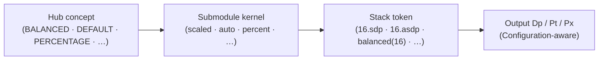
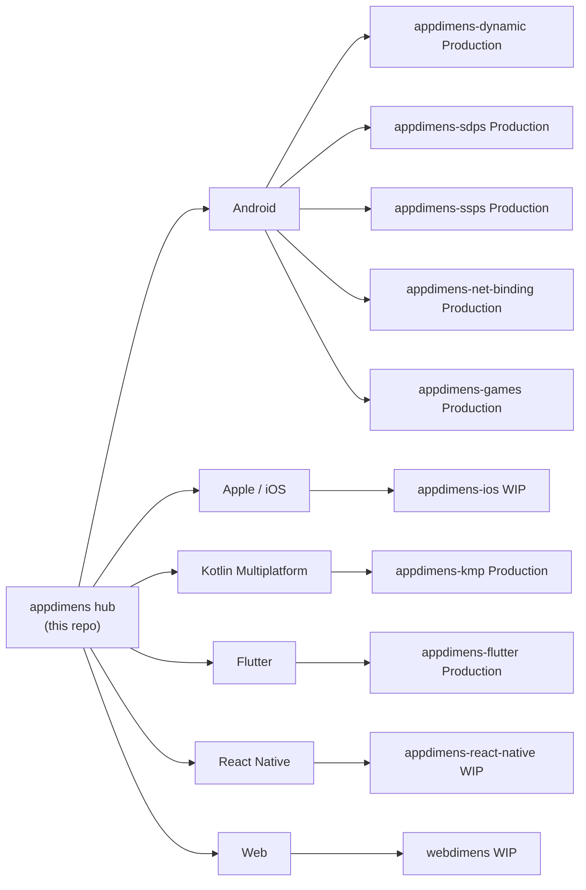

<div align="center">
   

# AppDimens — Smart Responsive Dimensions for Any Screen

**A family of responsive sizing libraries that replaces fragile `dp` / `sp` / `pt` / `px` with explicit, perceptual scaling kernels — same vocabulary, same math, across Android, .NET for Android / MAUI, Apple, KMP, Flutter, React Native and the Web.**

[](https://github.com/bodenberg/appdimens)
[](LICENSE)
[](#platform-matrix)
[](#the-14-scaling-kernels-at-a-glance)
[](CONTRIBUTING.md)

[](DOCS/README.md)
[](DOCS/GUIDE.md)
[](DOCS/EXAMPLES.md)

</div>

### Platform repositories (quick reference)

Each implementation lives in its **own GitHub repository** (not only the submodules in this hub). Status reflects the current product line described in that repo’s README.

| Repository | Platform | Status |
|------------|----------|--------|
| [appdimens-dynamic](https://github.com/bodenberg/appdimens-dynamic) | Android — Jetpack Compose, Kotlin Views, Java Views | **Production** |
| [appdimens-sdps](https://github.com/bodenberg/appdimens-sdps) | Android — XML `@dimen` SDP-style resources (+ Compose tokens) | **Production** |
| [appdimens-ssps](https://github.com/bodenberg/appdimens-ssps) | Android — XML SSP-style text resources (+ Compose tokens) | **Production** |
| [appdimens-net-binding](https://github.com/bodenberg/appdimens-net-binding) | **.NET 10 for Android** / **.NET MAUI** (Android) — C# bindings over the Maven AARs | **Production** |
| [appdimens-games](https://github.com/bodenberg/appdimens-games) | Android — game / NDK sizing helpers | **Production** |
| [appdimens-ios](https://github.com/bodenberg/appdimens-ios) | Apple — iOS / iPadOS / macOS (UIKit, SwiftUI, Metal) | Work in progress |
| [appdimens-kmp](https://github.com/bodenberg/appdimens-kmp) | Kotlin Multiplatform | **Production** |
| [appdimens-flutter](https://github.com/bodenberg/appdimens-flutter) | Flutter — Android, iOS, Web, desktop | **Production** |
| [appdimens-react-native](https://github.com/bodenberg/appdimens-react-native) | React Native — iOS & Android | Work in progress |
| [appdimens-web](https://github.com/bodenberg/appdimens-web) | Web — vanilla JS, React, Vue, Svelte, Angular | Work in progress |

Details, coordinates, and semver: see **[Platform matrix](#platform-matrix)** below.

> [!TIP]
> **TL;DR** — Plain `dp` / `sp` / `pt` / `px` factor out **density** but not **canvas extent** or **aspect ratio**. AppDimens models token sizing as a **family of one-dimensional maps** with explicit kernels (linear, hybrid linear–logarithmic, Weber–Fechner, Stevens, fluid clamp, geometric, letterbox/fill, density buckets, constraint-based resize) and gives you the **same vocabulary on every platform** so a `16.sdp` on Android Compose, a `balanced(16)` on iOS / Flutter / React Native, and a `webdimens.balanced(16)` on the Web all describe the same idea.

This repository is the **documentation hub**. Each platform library ships from its own submodule with its own semver, install line, and changelog. **The hub never pins versions** — always confirm the install line in the submodule README you depend on.

---

## Table of contents

1. [Platform repositories (quick reference)](#platform-repositories-quick-reference)
2. [What is AppDimens?](#what-is-appdimens)
3. [The problem it solves](#the-problem-it-solves)
4. [How AppDimens solves it](#how-appdimens-solves-it)
5. [Why AppDimens (advantages)](#why-appdimens-advantages)
6. [When to use AppDimens (scenarios)](#when-to-use-appdimens-scenarios)
7. [The 14 scaling kernels at a glance](#the-14-scaling-kernels-at-a-glance)
8. [Quick start (multi-stack)](#quick-start-multi-stack)
9. [Platform matrix](#platform-matrix)
10. [Hub vs submodules — who owns what](#hub-vs-submodules--who-owns-what)
11. [Documentation map (`DOCS/`)](#documentation-map-docs)
12. [Performance snapshot](#performance-snapshot)
13. [Comparison with alternatives](#comparison-with-alternatives)
14. [FAQ](#faq)
15. [Roadmap & status](#roadmap--status)
16. [Contributing, security, license](#contributing-security-license)
17. [Author](#author)

---

## What is AppDimens?

**AppDimens** is a multi-platform family of responsive sizing libraries. You write **a single base value** at the call-site — `16.sdp`, `balanced(16)`, `webdimens.balanced(16)` — and the library transforms it through an **explicit, named kernel** that reflects the current screen `Configuration` (width, height, aspect ratio, density, orientation, multi-window flags, fold state).

The hub publishes the **shared vocabulary** (BALANCED, DEFAULT, PERCENTAGE, …) and the **mathematical reference** for every kernel. Each platform repository (`appdimens-dynamic`, `appdimens-sdps`, `appdimens-ssps`, `appdimens-net-binding`, `appdimens-ios`, `appdimens-kmp`, `appdimens-flutter`, `appdimens-react-native`, `appdimens-web`, `appdimens-games`) implements that vocabulary natively, so design tokens travel across stacks without translation.

Two operating tracks coexist:

- **Runtime computation** (`appdimens-dynamic`, iOS, Flutter, RN, Web, KMP): a tiny kernel runs at call time, reading the live `Configuration` and producing a `Dp` / point / px value through the chosen strategy. Lock-free padded cache keeps hot-path cost at roughly **5 ns** per hit on a Snapdragon 888, ~**1 ns** on JVM (see [Performance snapshot](#performance-snapshot)).
- **Pre-computed resources** (`appdimens-sdps`, `appdimens-ssps`): thousands of pre-calculated `@dimen/_*sdp`, `@dimen/_*ssp`, `_*hdp`, `_*wdp` resources, ready to drop into XML — **zero-runtime sizing** for view systems and Compose alike.

You can — and many teams do — combine both.

---

## The problem it solves

Modern UIs ship on a moving target. The same code base must look right on:

| Form factor | Typical width (dp / pt) | What "48 looks like" with raw `dp/sp/pt` |
|-------------|--------------------------|-------------------------------------------|
| Watches | < 240 | 48 covers ~20% of the screen — too dominant |
| Small phones | 320–360 | ~14–15% — the calibrated baseline |
| Phablets / regular phones | 360–480 | 10–13% — already drifting |
| Small tablets | 600–720 | 6.7% — visibly cramped |
| Large tablets / foldables (open) | 720–960 | 5–6% — clearly undersized |
| TVs | 960–1920+ | 2.5–5% — practically invisible |
| Web / desktop viewports | 1024–3840+ | < 2% — broken |

`dp` / `sp` factor out **physical density** but not **canvas extent**, and they are blind to **aspect ratio** (a 4:3 tablet and a 21:9 phone receive the same number). Naïve linear scalers like SDP fix the smallness on tablets only to produce **oversized** UI on the same TVs.

Concretely, for a **48 dp button**:

| Approach | Phone (360 dp) | Tablet (720 dp) | TV (1080 dp) | Verdict |
|----------|----------------|------------------|---------------|---------|
| **Raw `dp` / `sp`** | 48 dp (13%) ✅ | 48 dp (6.7%) ❌ tiny | 48 dp (4.4%) ❌ invisible | Density-only |
| **Linear SDP / SSP** | 58 dp (16%) ✅ | 115 dp (16%) ❌ huge | 173 dp (16%) ❌ enormous | Over-scales |
| **AppDimens `auto` (BALANCED)** | 58 dp (16%) ✅ | ~70 dp (10%) ✅ | ~85 dp (8%) ✅ | Calibrated everywhere |

The 720 dp / 1080 dp rows above are reproducible from `DimenAutoDp` ([`auto.md`](https://github.com/bodenberg/appdimens-dynamic/blob/main/DOCUMENTATION/auto.md), hinge at 480 dp, `ln` gain 0.4).

---

## How AppDimens solves it



Token sizing is modeled as a **family of one-dimensional maps**

```
f_S : (b, c) ↦ f_S(b, c)
```

where `b` is the design-time base (a `dp` / `sp`) and `c` is a snapshot of the runtime `Configuration` (post orientation/multi-window plumbing). `S` selects a **kernel** — `scaled`, `auto`, `percent`, `power`, `logarithmic`, `fluid`, `interpolated`, `diagonal`, `perimeter`, `fit`, `fill`, `density`, `resize`, or `NONE`.

Every kernel obeys four invariants ([THEORY.md §1.2](DOCS/THEORY.md#1-problem-statement-and-design-axioms)):

1. **Reference fixed point.** `f_S(b, c₀) = b` on the calibrated reference canvas — your design comp size is preserved on the reference device.
2. **Monotone in canvas extent.** Bigger canvas ⇒ never smaller output.
3. **Bounded growth.** Output is sandwiched between linear and logarithmic envelopes — no runaway tablets/TVs.
4. **Aspect-ratio aware (opt-in).** The optional `a` suffix folds in an AR multiplier referenced to 16:9.

The verified constants (cross-checked against [`DesignScaleConstants.kt`](https://github.com/bodenberg/appdimens-dynamic/blob/main/library/src/main/java/com/appdimens/dynamic/core/DesignScaleConstants.kt)):

| Constant | Value | Meaning |
|----------|-------|---------|
| `BASE_WIDTH_DP` | `300f` | Reference width denominator (matches the 300 dp design-comp tradition) |
| `BASE_HEIGHT_DP` | `533f` | Companion height baseline |
| `REFERENCE_ASPECT_RATIO` | `1.78f` | Neutral AR (16:9) — multiplier is 1 here |
| Diagonal baseline | `√(300² + 533²) ≈ 611.63` dp | For `diagonal` kernel |
| Perimeter baseline | `833` dp | For `perimeter` kernel |
| `auto` hinge | measured axis **480 dp** | BALANCED switches from linear to log here |
| `auto` ln gain | `0.4f` | Log damping coefficient |

For the full math, see [DOCS/THEORY.md](DOCS/THEORY.md) and the canonical [`MATHEMATICS-AND-CALCULUS.md`](https://github.com/bodenberg/appdimens-dynamic/blob/main/DOCUMENTATION/MATHEMATICS-AND-CALCULUS.md) inside `appdimens-dynamic`.

---

## Why AppDimens (advantages)

Each bullet below either points to a verifiable file in this repository or a measurable constant.

### Engineering

- **Explicit kernels per call-site.** No surprise behaviour — `16.sdp` is **always** the `scaled` kernel and `16.asdp` is **always** the `auto` kernel. The Kotlin extension you write is the formula you read. ([`COMPOSE-API-CONVENTIONS.md`](https://github.com/bodenberg/appdimens-dynamic/blob/main/DOCUMENTATION/COMPOSE-API-CONVENTIONS.md))
- **Zero-XML option.** Pure code-driven sizing via [`appdimens-dynamic`](https://github.com/bodenberg/appdimens-dynamic/blob/main/README.md). Or pre-baked `@dimen` resources via [`appdimens-sdps`](https://github.com/bodenberg/appdimens-sdps/blob/main/README.md) / [`appdimens-ssps`](https://github.com/bodenberg/appdimens-ssps/blob/main/README.md) when you want XML tooling and zero-runtime cost.
- **Sub-microsecond hot path.** Padded, sharded, lock-free cache. **~5 ns** cache hit, **~2 ns** raw multiply (Snapdragon 888 hardware capture, see [`appdimens-dynamic/PERFORMANCE.md`](https://github.com/bodenberg/appdimens-dynamic/blob/main/PERFORMANCE.md)).
- **Foldable & multi-window aware.** Effective-axis selection consults `WindowManager` fold state and `isInMultiWindowMode`. Both behaviours are opt-out per call via the `i` / `ia` suffixes ([THEORY.md §3](DOCS/THEORY.md#3-effective-axis-selection-qualifier-inverter-multi-window)).
- **R8 / ProGuard ready.** AARs ship `consumer-rules.pro` and `res/raw/keep.xml` so apps can use `minifyEnabled`, R8 full mode (`android.enableR8.fullMode=true`), and `shrinkResources` without extra rules. See [`appdimens-dynamic/R8-PROGUARD.md`](https://github.com/bodenberg/appdimens-dynamic/blob/main/R8-PROGUARD.md).
- **Test- and preview-friendly.** Kernels are pure functions of `(base, Configuration)` — works identically inside `@Preview`, unit tests, and `BoxWithConstraints`.

### Design

- **Perceptual scaling.** Not just proportional — kernels like `auto`, `logarithmic`, `power` damp growth on large canvases the way human visual perception expects (Weber–Fechner, Stevens). ([THEORY.md §5](DOCS/THEORY.md#5-strategy-catalogue))
- **Aspect-ratio compensation, opt-in.** The `a` suffix folds an AR multiplier referenced to 16:9. Elongated phones / foldables / wide TVs keep their visual weight without bespoke `remember` blocks.
- **Orientation inverters.** Authored portrait but the device rotates? The `*Ph`, `*Lw`, `*Lh` token families switch the driving axis automatically. ([DOCS/ORIENTATION.md](DOCS/ORIENTATION.md))
- **Physical units (mm / cm / inch).** Real-world measurements where they matter (kiosks, AR, accessibility hit targets). ([`physical-units.md`](https://github.com/bodenberg/appdimens-dynamic/blob/main/DOCUMENTATION/physical-units.md))

### Ecosystem

- **Seven platform tracks** under one vocabulary — see [Platform matrix](#platform-matrix). Android Compose + XML, **.NET for Android / MAUI** (NuGet bindings), Apple (UIKit + SwiftUI), Kotlin Multiplatform, Flutter, React Native, Web (vanilla / React / Vue / Svelte / Angular), and a games surface with Android NDK + iOS Metal.
- **Compose 3.x package split.** Each kernel is its own Gradle source package (`compose.scaled`, `compose.auto`, `compose.percent`, …). You import what you use and nothing else — the binary footprint stays small.

### Maintenance & honesty

- **Every kernel is cited** to a Kotlin file under [`appdimens-dynamic/DOCUMENTATION/`](https://github.com/bodenberg/appdimens-dynamic/tree/main/DOCUMENTATION) and a regression test under `appdimens-dynamic/library/`.
- **Hub theory is reproducible.** Numerical comparisons in [DOCS/THEORY.md §8](DOCS/THEORY.md) come from the same kernels you ship.
- **No marketing-rank claims.** The hub does not pretend a single global "best library" ranking. Categorical trade-offs vs other tools are discussed honestly in [Comparison with alternatives](#comparison-with-alternatives).

---

## When to use AppDimens (scenarios)

| Scenario | Why AppDimens helps | Suggested entry point |
|----------|--------------------|------------------------|
| **Multi-form-factor product** (phones + tablets + foldables in one binary) | `auto` (BALANCED) keeps the same UI calibrated on a 360 dp phone *and* a 720 dp tablet, without the SDP overshoot | [`appdimens-dynamic` quick start](https://github.com/bodenberg/appdimens-dynamic/blob/main/README.md#quick-start--scaled-compose) → tokens `asdp` / `assp` |
| **TV / large-screen companion app** | `logarithmic` and `auto` damp growth on canvases beyond 480 dp instead of inflating linearly | [`logarithmic.md`](https://github.com/bodenberg/appdimens-dynamic/blob/main/DOCUMENTATION/logarithmic.md) · [`auto.md`](https://github.com/bodenberg/appdimens-dynamic/blob/main/DOCUMENTATION/auto.md) |
| **Cross-platform design system** | Same vocabulary on Android / iOS / KMP / Flutter / RN / Web — design tokens travel verbatim | [DOCS/PLATFORMS.md](DOCS/PLATFORMS.md) |
| **XML view system with breakpoint resources** | `@dimen/_16sdp`, `_18ssp`, `_300wdp`, … shipped pre-computed; no runtime cost | [`appdimens-sdps`](https://github.com/bodenberg/appdimens-sdps/blob/main/README.md) · [`appdimens-ssps`](https://github.com/bodenberg/appdimens-ssps/blob/main/README.md) |
| **.NET MAUI / .NET for Android app** | Same Android AARs and `@dimen` resources via NuGet — C# APIs (`DimenSdp`, `DimenSsp`, runtime `AppDimens`) | [`appdimens-net-binding`](https://github.com/bodenberg/appdimens-net-binding) · [NuGet](https://www.nuget.org/packages?q=Bodenberg.AppDimens) |
| **Typography with hard min/max bounds** | `fluid` clamps a typographic band (e.g. 16–24 sp between 320–768 dp) the same way CSS `clamp()` would, with optional AR | [`fluid.md`](https://github.com/bodenberg/appdimens-dynamic/blob/main/DOCUMENTATION/fluid.md) |
| **Game UI / HUD on arbitrary viewports** | `fit` (letterbox) and `fill` (cover) keep the HUD intact across aspect ratios | [`fit.md`](https://github.com/bodenberg/appdimens-dynamic/blob/main/DOCUMENTATION/fit.md) · [`fill.md`](https://github.com/bodenberg/appdimens-dynamic/blob/main/DOCUMENTATION/fill.md) |
| **Native game rendering (NDK / Metal)** | Specialized modules with C++/NDK on Android (`appdimens-games`) and Metal on iOS | [`appdimens-games/`](https://github.com/bodenberg/appdimens-games/tree/main) |
| **Real-world physical sizing** (kiosks, AR, accessibility targets) | `mm` / `cm` / `inch` helpers on every stack | [`physical-units.md`](https://github.com/bodenberg/appdimens-dynamic/blob/main/DOCUMENTATION/physical-units.md) |
| **Rotation- / foldable-sensitive layouts** | Base-orientation + `*Ph` / `*Lw` / `*Lh` inverters | [DOCS/ORIENTATION.md](DOCS/ORIENTATION.md) |
| **Container-fit titles / square widgets** | `resize` builders (`autoResizeTextSp`, `autoResizeSquareSize`) pick the largest size in a min..max range that still fits | [`resize.md`](https://github.com/bodenberg/appdimens-dynamic/blob/main/DOCUMENTATION/resize.md) |

---

## The 14 scaling kernels at a glance

Sourced from [`appdimens-dynamic/DOCUMENTATION/`](https://github.com/bodenberg/appdimens-dynamic/tree/main/DOCUMENTATION) and cross-checked in [DOCS/THEORY.md §5](DOCS/THEORY.md#5-strategy-catalogue) and [DOCS/PLATFORMS.md](DOCS/PLATFORMS.md). Tokens shown are Compose 3.x; iOS / Flutter / RN / Web use builder names — see [PLATFORMS.md](DOCS/PLATFORMS.md).

| # | Kernel | Hub label | Compose token sketch | Primary use case | Reference |
|---|--------|-----------|----------------------|------------------|-----------|
| 1 | `scaled` | **DEFAULT / FIXED** | `sdp`, `hdp`, `wdp`, `ssp`, `sem`, `sdpa` | Phone-first SDP-style baseline (most common) | [`scaled.md`](https://github.com/bodenberg/appdimens-dynamic/blob/main/DOCUMENTATION/scaled.md) |
| 2 | `auto` | **BALANCED** | `asdp`, `ahdp`, `awdp`, `assp` | Multi-device hybrid (linear under 480 dp, logarithmic above) | [`auto.md`](https://github.com/bodenberg/appdimens-dynamic/blob/main/DOCUMENTATION/auto.md) |
| 3 | `percent` | **PERCENTAGE / DYNAMIC** | `psdp`, `phdp`, `pwdp`, plus literal `space*` percentages | Axis-heavy / proportional containers and grids | [`percent.md`](https://github.com/bodenberg/appdimens-dynamic/blob/main/DOCUMENTATION/percent.md) |
| 4 | `power` | Stevens-style | `pwsdp`, `pwssp` | Configurable sublinear curve (exponent 0.6–0.9) | [`power.md`](https://github.com/bodenberg/appdimens-dynamic/blob/main/DOCUMENTATION/power.md) |
| 5 | `logarithmic` | Weber–Fechner | `logsdp`, `logssp` | Maximum damping on TV / very large tablets | [`logarithmic.md`](https://github.com/bodenberg/appdimens-dynamic/blob/main/DOCUMENTATION/logarithmic.md) |
| 6 | `fluid` | Clamp band | `fsdp`, `fssp` | Typography / spacing between explicit min/max | [`fluid.md`](https://github.com/bodenberg/appdimens-dynamic/blob/main/DOCUMENTATION/fluid.md) |
| 7 | `interpolated` | Fixed–linear blend | `isdp`, `issp` | Moderate scaling (50% linear / 50% fixed) | [`interpolated.md`](https://github.com/bodenberg/appdimens-dynamic/blob/main/DOCUMENTATION/interpolated.md) |
| 8 | `diagonal` | Euclidean | `dsdp`, `dssp` | Scale by screen diagonal (true physical feel) | [`diagonal.md`](https://github.com/bodenberg/appdimens-dynamic/blob/main/DOCUMENTATION/diagonal.md) |
| 9 | `perimeter` | L¹ | `psdp` (perimeter package), `pssp` | Scale by `W + H` perimeter | [`perimeter.md`](https://github.com/bodenberg/appdimens-dynamic/blob/main/DOCUMENTATION/perimeter.md) |
| 10 | `fit` | Letterbox | `fitsdp`, `fitssp` | Game / canvas content that must not crop | [`fit.md`](https://github.com/bodenberg/appdimens-dynamic/blob/main/DOCUMENTATION/fit.md) |
| 11 | `fill` | Cover | `fillsdp`, `fillssp` | Game / canvas content that must fill | [`fill.md`](https://github.com/bodenberg/appdimens-dynamic/blob/main/DOCUMENTATION/fill.md) |
| 12 | `density` | DPI-bucket | `densdp`, `denssp` | Scale only when the dpi bucket changes | [`density.md`](https://github.com/bodenberg/appdimens-dynamic/blob/main/DOCUMENTATION/density.md) |
| 13 | `resize` | Constraint geometry | `autoResizeTextSp`, `autoResizeSquareSize`, `ResizeBound` | Pick the largest size in a min..max range that fits | [`resize.md`](https://github.com/bodenberg/appdimens-dynamic/blob/main/DOCUMENTATION/resize.md) |
| 14 | `physical units` | Real-world | `10.mm`, `8.cm`, `5.inch` | Real-world measurements (kiosks, AR, accessibility) | [`physical-units.md`](https://github.com/bodenberg/appdimens-dynamic/blob/main/DOCUMENTATION/physical-units.md) |

Plus a conceptual **`NONE`** (raw `Dp` / `Sp`) for surfaces that must stay constant.

> **Aspect-ratio suffix.** Append `a` to scaled / auto / interpolated / logarithmic / power tokens (`16.sdpa`, `16.asdpa`, `16.sspa`, `16.assp`) to fold in the AR multiplier described in [THEORY.md §4](DOCS/THEORY.md#4-the-aspect-ratio-mould-the-optional-a-suffix). Append `i` / `ia` to opt out of the multi-window heuristic. The `fluid` package exposes AR as an explicit builder parameter instead.

---

## Quick start (multi-stack)

> **Install lines below are illustrative.** The authoritative semver line for every artifact lives in the **submodule README** — click through before pinning.

### Android — Jetpack Compose (`appdimens-dynamic`, production)

```kotlin
import com.appdimens.dynamic.compose.*

Box(
    Modifier
        .padding(16.sdp)       // scaled — SDP-style baseline
        .width(100.wdp)        // scaled — width axis
        .height(48.hdp)        // scaled — height axis
) {
    Text("Hello", fontSize = 16.ssp)
    // For the hybrid BALANCED curve, use the `auto` tokens:
    // padding(16.asdp), fontSize = 16.assp
}
```

→ [`appdimens-dynamic/README.md#quick-start--scaled-compose`](https://github.com/bodenberg/appdimens-dynamic/blob/main/README.md#quick-start--scaled-compose) for full install line and `AppDimensProvider` setup.

### Android — XML resources (`appdimens-sdps` + `appdimens-ssps`, production)

```xml
<TextView
    android:layout_width="@dimen/_300sdp"
    android:layout_height="wrap_content"
    android:padding="@dimen/_16sdp"
    android:textSize="@dimen/_18ssp"
    android:text="Hello" />
```

→ [`appdimens-sdps/README.md`](https://github.com/bodenberg/appdimens-sdps/blob/main/README.md) · [`appdimens-ssps/README.md`](https://github.com/bodenberg/appdimens-ssps/blob/main/README.md).

### .NET for Android / MAUI (`appdimens-net-binding`, production)

Bindings for **.NET 10** (`net10.0-android`) that embed the upstream Maven AARs, run **Xamarin.Android** binding generation, and expose the Kotlin/Java APIs to C#. Pick the same three artifacts you would on Gradle:

| NuGet package | Android library | Focus |
|---------------|-----------------|-------|
| [Bodenberg.AppDimens.Sdps](https://www.nuget.org/packages/Bodenberg.AppDimens.Sdps) | [appdimens-sdps](https://github.com/bodenberg/appdimens-sdps) | Layout + typography — SDP/HDP/WDP and SSP/HSP/WSP via `@dimen` + code |
| [Bodenberg.AppDimens.Ssps](https://www.nuget.org/packages/Bodenberg.AppDimens.Ssps) | [appdimens-ssps](https://github.com/bodenberg/appdimens-ssps) | Typography only — SSP/HSP/WSP |
| [Bodenberg.AppDimens.Dynamic](https://www.nuget.org/packages/Bodenberg.AppDimens.Dynamic) | [appdimens-dynamic](https://github.com/bodenberg/appdimens-dynamic) | Runtime kernels — all scaling strategies, no pre-built XML grids |

```bash
dotnet add package Bodenberg.AppDimens.Sdps --version 3.5.1.4
# or Bodenberg.AppDimens.Ssps / Bodenberg.AppDimens.Dynamic
```

```csharp
using Com.Appdimens.Sdps.Code;

public class MainActivity : Activity
{
    protected override void OnCreate(Bundle? savedInstanceState)
    {
        base.OnCreate(savedInstanceState);
        DimenSdp.WarmupSdpsFactors(this);
        float paddingPx = DimenSdp.Sdp(this, 16);
        float titlePx   = DimenSsp.Ssp(this, 18);
    }
}
```

XML layouts use the same bundled resources as on Gradle (`@dimen/_16sdp`, `@dimen/_18ssp`, …). **Jetpack Compose** extensions in the AAR are not fully surfaced in C# — prefer **`DimenSdp` / `DimenSsp`** in Activities/Fragments, XML `@dimen`, or the **`ScaledDp` / `ScaledSp`** builders where generated.

**Requirements:** .NET **10** with Android or MAUI workload, **API 24+**, JDK **17 or 21**, Android SDK platform **36+** for local binding builds. Binding source, smoke tests, and publish notes: [`appdimens-net-binding`](https://github.com/bodenberg/appdimens-net-binding).

### iOS — SwiftUI (`appdimens-ios`, work in progress)

```swift
Text("Hello")
    .font(.system(size: AppDimens.shared.balanced(16).toPoints()))
    .padding(AppDimens.shared.balanced(16).toPoints())
    .frame(width: AppDimens.shared.balanced(300).toPoints())
```

→ [`appdimens-ios/`](https://github.com/bodenberg/appdimens-ios/tree/main) — SwiftPM `3.1.6` (`AppDimensDynamic` / `AppDimens` / satellite products).

### Kotlin Multiplatform (`appdimens-kmp`, production)

Same vocabulary on **Android · Desktop (JVM) · iOS · macOS · Web (JS + Wasm) · Linux · Windows** via Jetpack Compose Multiplatform:

```kotlin
implementation(platform("io.github.bodenberg:appdimens-kmp-bom:1.0.1"))
implementation("io.github.bodenberg:appdimens-kmp")
implementation("io.github.bodenberg:appdimens-kmp-percent") // optional strategy modules
```

Packages use `com.appdimens.kmp.*` — keep the KMP artifact distinct from the Android `com.appdimens.dynamic.*` one. Full guide: [`appdimens-kmp/`](https://github.com/bodenberg/appdimens-kmp/tree/main).

### Flutter (`appdimens-flutter`, production)

```dart
import 'package:appdimens_flutter/appdimens.dart';

Box(
  width: 100.wdp,
  height: 48.hdp,
).padding(EdgeInsets.all(16.sdp))
 .child(Text('Hello', fontSize: 16.ssp));
```

→ [`appdimens-flutter/`](https://github.com/bodenberg/appdimens-flutter/tree/main) — pub.dev `appdimens_flutter ^3.2.0` (+ per-strategy satellites and the `appdimens_bom` all-in-one package).

### React Native (`appdimens-react-native`, work in progress)


```tsx
const { balanced } = useAppDimens();

return (
  <View style={{ padding: balanced(16) }}>
    <Text style={{ fontSize: balanced(16) }}>Hello</Text>
  </View>
);
```


→ [`appdimens-react-native/`](https://github.com/bodenberg/appdimens-react-native/tree/main).

### Web — `webdimens` (work in progress)

```ts
import { webdimens } from 'webdimens';

document.getElementById('title')!.style.fontSize = webdimens.balanced(24);
document.getElementById('container')!.style.padding  = webdimens.balanced(16);
```

→ [`appdimens-web/`](https://github.com/bodenberg/appdimens-web/tree/main) for framework-specific (React / Vue / Svelte / Angular) hooks.

---

## Platform matrix

Each folder below is its own Git submodule. **Always confirm semver in the submodule README** before pinning.

| Submodule | Platform | What it ships | Status | Illustrative coordinate |
|-----------|----------|----------------|--------|--------------------------|
| [`appdimens-dynamic/`](https://github.com/bodenberg/appdimens-dynamic/tree/main) | Android (Compose, Kotlin, Java) | Runtime kernels — all **14 scaling modes** (12 strategies + Resize + Physical units) | **Production** | `io.github.bodenberg:appdimens-dynamic:3.1.9` |
| [`appdimens-sdps/`](https://github.com/bodenberg/appdimens-sdps/tree/main) | Android (XML, Compose, Kotlin, Java) | Pre-computed `@dimen/_*sdp` / `_*hdp` / `_*wdp` resources + Compose tokens | **Production** | `io.github.bodenberg:appdimens-sdps:3.1.7` |
| [`appdimens-ssps/`](https://github.com/bodenberg/appdimens-ssps/tree/main) | Android (XML, Compose, Kotlin, Java) | Pre-computed `@dimen/_*ssp` text resources + Compose tokens | **Production** | `io.github.bodenberg:appdimens-ssps:3.1.7` |
| [`appdimens-games/`](https://github.com/bodenberg/appdimens-games/tree/main) | Android (Kotlin + C++/NDK + OpenGL ES) | Specialized game-loop dimension types, Vector2D / Rectangle, viewport modes | **Production** | `io.github.bodenberg:appdimens-games:3.0.0` |
| [`appdimens-ios/`](https://github.com/bodenberg/appdimens-ios/tree/main) | iOS / macOS (UIKit + SwiftUI + Metal) | `AppDimens.shared.balanced(_)` / `defaultScaling(_)` / `smart(_)` / fluid + Metal games | Work in progress | SwiftPM `3.1.6` (see submodule) |
| [`appdimens-kmp/`](https://github.com/bodenberg/appdimens-kmp/tree/main) | Kotlin Multiplatform | Same vocabulary as `appdimens-dynamic`, multiplatform targets | **Production** | `io.github.bodenberg:appdimens-kmp:1.0.1` |
| [`appdimens-flutter/`](https://github.com/bodenberg/appdimens-flutter/tree/main) | Flutter (Android / iOS / Web / desktop) | Suffix grammar `16.sdp` / `wdp` / `hdp` / `ssp`, per-strategy satellite packages, `appdimens_bom` | **Production** | pub.dev `appdimens_flutter ^3.2.0` |
| [`appdimens-react-native/`](https://github.com/bodenberg/appdimens-react-native/tree/main) | React Native (iOS / Android) | `useAppDimens()` hook with `balanced` / `defaultScaling` / `smart` / `fluid` | Work in progress | `appdimens-react-native@2.0.0` |
| [`appdimens-web/`](https://github.com/bodenberg/appdimens-web/tree/main) | Web (vanilla / React / Vue / Svelte / Angular) | `webdimens.balanced(_)` + framework-specific hooks/services | Work in progress | `webdimens@2.0.0` |
| [`appdimens-net-binding/`](https://github.com/bodenberg/appdimens-net-binding/tree/main) | **.NET 10 for Android** / **.NET MAUI** (Android) | NuGet bindings — embeds Maven AARs, C# over `DimenDp` / `DimenSsp` / `AppDimens` APIs | **Production** | `Bodenberg.AppDimens.Sdps` · `Ssps` · `Dynamic` **3.5.1.4** ([NuGet](https://www.nuget.org/packages?q=Bodenberg.AppDimens)) |

**GitHub mirrors** — [dynamic](https://github.com/bodenberg/appdimens-dynamic) · [kmp](https://github.com/bodenberg/appdimens-kmp) · [sdps](https://github.com/bodenberg/appdimens-sdps) · [ssps](https://github.com/bodenberg/appdimens-ssps) · [**.net-binding**](https://github.com/bodenberg/appdimens-net-binding) · [games](https://github.com/bodenberg/appdimens-games) · [ios](https://github.com/bodenberg/appdimens-ios) · [flutter](https://github.com/bodenberg/appdimens-flutter) · [react-native](https://github.com/bodenberg/appdimens-react-native) · [web](https://github.com/bodenberg/appdimens-web).

### Clone with submodules

```bash
git clone --recurse-submodules https://github.com/bodenberg/appdimens.git
cd appdimens && git submodule update --init --recursive
```

Only need one stack? Prefer cloning the upstream repo for that artifact from [the author's repositories](https://github.com/bodenberg?tab=repositories&q=appdimens) instead of this umbrella.

---

## Hub vs submodules — who owns what



> [!IMPORTANT]
> **Responsibility split**
>
> - **Hub (`DOCS/` + this README)** owns: shared vocabulary, mathematical theory, kernel taxonomy, cross-platform mapping, migration paths, hub-level FAQ. **No pinned versions, ever.**
> - **Submodules** own: source, semver, Gradle / npm / pod / pub install lines, R8/ProGuard rules, per-API changelogs, code-level docs, regression tests.
>
> When prose in the hub disagrees with the submodule, **the submodule is the source of truth.**

### Runtime `dynamic` vs baked `sdps` / `ssps` on Android

| | **`appdimens-dynamic`** | **`appdimens-sdps` / `appdimens-ssps`** |
|--|--------------------------|------------------------------------------|
| Computation | Runtime from live `Configuration` | Pre-computed `res/values-sw*/dimens.xml` buckets |
| Flexibility | All 14 kernels, per-call AR / inverter / qualifier flags | One curve per artifact, `@dimen` friendly |
| Cost | Tiny AAR; ~5 ns cache hit, ~2 ns no-AR multiply | Larger resource tables, zero runtime |
| XML integration | Only via Compose / `code` package | First-class `@dimen/_16sdp` etc. |

Many teams **mix both**: SDP/SSP for XML layouts, `appdimens-dynamic` for Compose / Kotlin-side dimensions. Full taxonomy of when to pick which: [DOCS/THEORY.md](DOCS/THEORY.md) and [DOCS/GUIDE.md](DOCS/GUIDE.md).

---

## Documentation map (`DOCS/`)

The `DOCS/` folder is **theory-only** — concepts, math, cross-platform mapping, migration. **Choose your learning path**:

| Goal | Read | Then |
|------|------|------|
| **I want to ship today** | [DOCS/GUIDE.md](DOCS/GUIDE.md) — strategy decision tree, FAQs, common patterns | Submodule README for your stack |
| **I want to understand the math** | [DOCS/THEORY.md](DOCS/THEORY.md) — formal kernels, axioms, comparisons | [`MATHEMATICS-AND-CALCULUS.md`](https://github.com/bodenberg/appdimens-dynamic/blob/main/DOCUMENTATION/MATHEMATICS-AND-CALCULUS.md) |
| **I'm migrating from 1.x / 2.x / SDP–SSP** | [DOCS/MIGRATION.md](DOCS/MIGRATION.md) — legacy `.fxdp` / `.dydp` / unified DSL → Compose 3.x packages | The submodule changelog you ship |
| **I'm porting across stacks** | [DOCS/PLATFORMS.md](DOCS/PLATFORMS.md) — concept ↔ submodule API, verified constants | The matching submodule README |
| **I rotate / foldable my UI** | [DOCS/ORIENTATION.md](DOCS/ORIENTATION.md) — base orientation, `*Ph` / `*Lw` / `*Lh` inverters | [`COMPOSE-API-CONVENTIONS.md`](https://github.com/bodenberg/appdimens-dynamic/blob/main/DOCUMENTATION/COMPOSE-API-CONVENTIONS.md) |
| **I want copy-paste recipes** | [DOCS/EXAMPLES.md](DOCS/EXAMPLES.md) — long-form snippets per stack | The submodule's `app/` sample where available |

### Visual & interactive resources

[](DOCS/AppDimens_Precision_Scaling.pdf) [](DOCS/AppDimens_Precision_Android_Scaling.pdf) [](DOCS/AppDimens_Precision_UI_Scaling.pdf) [](DOCS/Beyond_DP_Scaling.pdf)

[](DOCS/html/SCALING_COMPARISON_COMPLETE.html) [](DOCS/html/SCALING_COMPARISON_2.html)

[](IMAGES/README.md)

---

## Performance snapshot

Numbers captured on **Xiaomi 2107113SG (Snapdragon 888 · Android 14)** physical hardware, debug build without minify. Full methodology, R8 deltas, and per-device variability discussed in [`appdimens-dynamic/PERFORMANCE.md`](https://github.com/bodenberg/appdimens-dynamic/blob/main/PERFORMANCE.md).

| Operation | Result | Notes |
|-----------|--------|-------|
| **Raw math, no AR** | **~2 ns** | `SCALED` / `AUTO` / `FLUID` / `PERCENT` fast-bypass path (cache is intentionally skipped — a 2 ns multiply is cheaper than the ~5 ns hash) |
| **Raw math with AR** | ~45 ns | `ln()` evaluation on hardware |
| **Cache hit (no AR)** | **~5 ns** | Lock-free padded sharded cache lookup |
| **Cache hit (with AR)** | **~35 ns** | Zero-math path for AR kernels |
| **Batch resolution (100 items)** | ~169 ns | `getBatch()` API, SIMD-friendly loop |
| **Persistence load (100 entries)** | 0.76 ms | Cold start from disk-persisted cache |
| **JVM cache hit (local)** | **~1 ns** | Linux + JVM 17 |
| **Real-world (1 000-item Compose scroll)** | ~996 ms total / ~996 µs per item | Indistinguishable from baseline; 0% jank at 120 FPS |

With R8 + minify on release builds, the dashboard-style harness drops further (~125–155 ns micro combined, ~367–380 ns per-item macro). See the **Build variants & R8** note at the top of [`PERFORMANCE.md`](https://github.com/bodenberg/appdimens-dynamic/blob/main/PERFORMANCE.md).

---

## Comparison with alternatives

The hub does **not** publish a single global "score / 100" ranking — comparisons depend heavily on form-factor mix, design philosophy, and what you measure. Instead, here are the honest **categorical** trade-offs. Quantitative kernel comparisons live in [DOCS/THEORY.md §8–10](DOCS/THEORY.md#8-numerical-comparison-across-a-sweep-of-sw).

| Approach | What it does well | What AppDimens adds |
|----------|--------------------|---------------------|
| **Raw `dp` / `sp` / `pt` / `px`** | Zero deps, predictable on the calibrated device | Calibration across canvas extent and aspect ratio, not just density |
| **Linear SDP / SSP (e.g. Intuit `sdp-android`)** | Pre-computed `@dimen` resources, XML-native | Same baked resources (`appdimens-sdps`/`-ssps`) **plus** non-linear kernels (`auto`, `logarithmic`, `power`, `fluid`) — and you can mix runtime computation in Compose |
| **CSS `vw` / `vh` / `clamp()` / container queries** | First-class in modern browsers, no JS | A single vocabulary that travels off the Web (iOS / Android / Flutter / RN) — `appdimens-web` integrates `clamp()`-style behaviour as the `fluid` kernel |
| **`ScreenUtil` / `size-matters` / similar libraries** | Single dependency, friendly API | Strategy-per-call-site instead of a single global curve; foldable + multi-window heuristics; AR compensation; reproducible math doc per kernel |

If your product already standardizes on one of the rows above, keep comparing trade-offs against your form-factor mix; the [fast path in GUIDE.md](DOCS/GUIDE.md#fast-path-about-30-seconds) summarizes kernel choice in one screen.

---

## FAQ

**Which strategy should I reach for first?**
**`auto`** (BALANCED) for multi-device, **`scaled`** for phone-first / SDP-style, **`percent`** for axis-heavy containers. Full decision tree: [DOCS/GUIDE.md "Fast path"](DOCS/GUIDE.md#fast-path-about-30-seconds).

**Will this break my existing SDP / SSP layouts?**
No. `appdimens-sdps` / `appdimens-ssps` ship the canonical SDP/SSP resource tables (`@dimen/_16sdp`, …) so existing XML keeps working. You can adopt the runtime `appdimens-dynamic` kernels gradually inside Compose. Migration story: [DOCS/MIGRATION.md](DOCS/MIGRATION.md).

**Does it work in pure XML layouts?**
Yes — `appdimens-sdps` and `appdimens-ssps` are XML-native (`@dimen/_16sdp`, `@dimen/_18ssp`, …). For runtime kernels, `appdimens-dynamic` exposes a `code` package for Views and a `compose` package for Compose.

**Does it work inside `@Preview` / unit tests?**
Yes. Every kernel is a pure function of `(base, Configuration)`. Compose previews resolve as on a regular device — and you can override `LocalConfiguration` to simulate any canvas.

**Will rotation / foldables break my proportions?**
By design no. Effective-axis selection consults `Configuration` and `WindowManager` fold state. For authored portrait → device landscape (or vice versa), use the `*Ph` / `*Lw` / `*Lh` inverter tokens. See [DOCS/ORIENTATION.md](DOCS/ORIENTATION.md).

**Is the cache thread-safe?**
Yes. It is a lock-free **padded sharded cache** (128-byte shards to avoid false sharing on ARM64) with bypass for the simplest no-AR multiplies. Details in [`appdimens-dynamic/PERFORMANCE.md`](https://github.com/bodenberg/appdimens-dynamic/blob/main/PERFORMANCE.md).

**Can I keep some sizes truly constant?**
Yes — use raw `Dp` / `Sp` (or `.dp` / `.sp` Compose extensions) for icons that must stay 24 dp everywhere. The conceptual **`NONE`** kernel is exactly this.

**What changed since 2.x?**
On Compose, the old unified DSL (`.fxdp`, `.dydp`, `.balanced().dp`) was split into **strategy packages** (`compose.scaled`, `compose.auto`, `compose.percent`, …). Naming rename `Fixed → DEFAULT`, `Dynamic → PERCENTAGE` is purely narrative; Gradle uses `scaled` and `percent`. iOS / Flutter / RN / Web keep their builder names. Full mapping: [DOCS/MIGRATION.md](DOCS/MIGRATION.md).

---

## Roadmap & status

- ✅ **Production:** `appdimens-dynamic` (**3.1.9**), `appdimens-sdps` / `appdimens-ssps` (**3.1.7**) (Android); `appdimens-kmp` (**1.0.1**, Kotlin Multiplatform); `appdimens-flutter` (**3.2.0**, pub.dev); `appdimens-games` (**3.0.0**, Android NDK); [`appdimens-net-binding`](https://github.com/bodenberg/appdimens-net-binding) (**.NET 10 for Android** / **MAUI** — [Bodenberg.AppDimens.Sdps](https://www.nuget.org/packages/Bodenberg.AppDimens.Sdps), [Ssps](https://www.nuget.org/packages/Bodenberg.AppDimens.Ssps), [Dynamic](https://www.nuget.org/packages/Bodenberg.AppDimens.Dynamic)).
- 🔄 **Work in progress:** `appdimens-ios`, `appdimens-react-native`, `appdimens-web`.
- 🧪 **Hub theory:** kernel taxonomy and verified constants are stable; benchmark deltas continue to track new device classes ([`PERFORMANCE.md`](https://github.com/bodenberg/appdimens-dynamic/blob/main/PERFORMANCE.md)).

Issues about **this hub repo** (typos, dead links, missing concept docs) → [Hub issues](https://github.com/bodenberg/appdimens/issues). **Shipping bugs** (compile errors, wrong numbers, build problems) belong in the **submodule repository** you depend on so they reach the maintainers and CI of that artifact.

---

## Contributing, security, license

[](CONTRIBUTING.md) [](SECURITY.md) [](CODE_OF_CONDUCT.md) [](CHANGELOG.md) [](LICENSE)

- **[CONTRIBUTING.md](CONTRIBUTING.md)** — how to propose hub or submodule changes, doc style, PR checklist.
- **[SECURITY.md](SECURITY.md)** — responsible disclosure channel for vulnerabilities.
- **[CODE_OF_CONDUCT.md](CODE_OF_CONDUCT.md)** — community expectations.
- **[CHANGELOG.md](CHANGELOG.md)** — high-level coordinated-release history; each submodule maintains its own detailed changelog.
- **[LICENSE](LICENSE)** — Apache 2.0.

---

## Author

**Jean Bodenberg** — [@bodenberg](https://github.com/bodenberg) · [appdimens-project.web.app](https://appdimens-project.web.app/)

If AppDimens helps your project, please ⭐ this repo and the submodules you use — visibility is what funds further work.

---

<div align="center">

[📚 DOCS](DOCS/README.md) · [📘 GUIDE](DOCS/GUIDE.md) · [📐 THEORY](DOCS/THEORY.md) · [💡 EXAMPLES](DOCS/EXAMPLES.md) · [🧭 PLATFORMS](DOCS/PLATFORMS.md) · [♻️ MIGRATION](DOCS/MIGRATION.md) · [🔄 ORIENTATION](DOCS/ORIENTATION.md)

</div>
