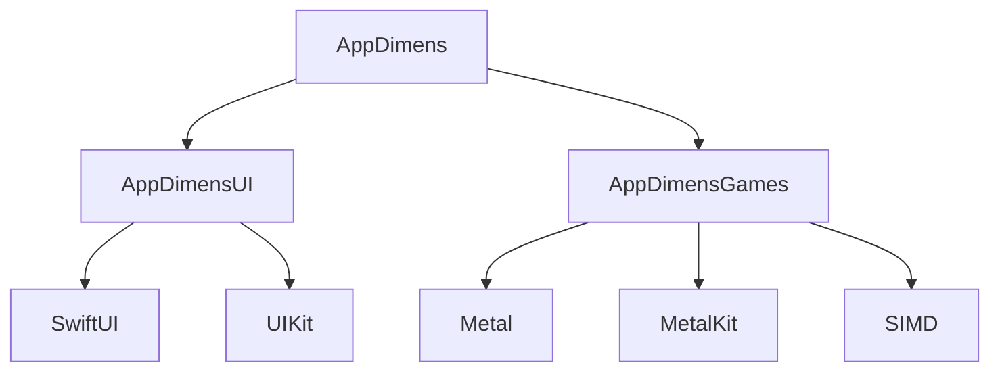

# 📚 AppDimens iOS Documentation

> **Complete API Documentation and Implementation Guide for iOS, macOS, tvOS, and watchOS**

This directory contains comprehensive documentation for all AppDimens iOS modules, covering SwiftUI, UIKit, Metal integration, and cross-platform consistency.

## 📖 Documentation Structure

### 🏗️ Module Documentation

| Module | Description | Platforms | Key Features |
|--------|-------------|-----------|--------------|
| **[AppDimens](AppDimens/)** | Core functionality | iOS 13+, macOS 10.15+, tvOS 13+, watchOS 6+ | DY/FX models, caching, qualifiers |
| **[AppDimensUI](AppDimensUI/)** | UI extensions | iOS 13+, macOS 10.15+, tvOS 13+, watchOS 6+ | SwiftUI extensions, UIKit integration |
| **[AppDimensGames](AppDimensGames/)** | Game development | iOS 13+, macOS 10.15+ | Metal integration, viewport management, SIMD |

### 📋 Documentation Formats

Each module includes documentation in multiple formats:

- **📘 HTML**: Interactive web documentation with search and navigation
- **📝 Markdown**: GitHub-compatible documentation with examples
- **📖 SwiftDoc**: Traditional Swift documentation for Xcode integration

## 🚀 Quick Start

### 1. Installation

#### Swift Package Manager

```swift
dependencies: [
    .package(url: "https://github.com/bodenberg/appdimens.git", from: "1.0.8")
]
```

#### CocoaPods

```ruby
# Podfile
pod 'AppDimens'
```

### 2. Basic Usage

```swift
import AppDimens

// Dynamic scaling
let dynamicWidth = AppDimens.shared.dynamic(300).toPoints()

// Fixed scaling with aspect ratio
let fixedHeight = AppDimens.shared.fixed(200)
    .aspectRatio(enable: true)
    .toPoints()

// Game development
let gamesManager = AppDimensGames.shared
gamesManager.initialize(device: metalDevice, viewport: viewport)
let buttonSize = gamesManager.uniform(48)
```

### 3. SwiftUI Integration

```swift
import SwiftUI
import AppDimensUI

struct ResponsiveView: View {
    var body: some View {
        VStack(spacing: 16.fxpt) {
            Text("Responsive Title")
                .font(.fxSystem(size: 18, weight: .semibold))
            
            Text("This adapts to any screen size")
                .font(.fxSystem(size: 14))
                .foregroundColor(.secondary)
        }
        .fxPadding(16)
        .dyFrame(width: 300)
        .fxFrame(height: 200)
        .background(Color(.systemGray6))
        .fxCornerRadius(12)
        .withAppDimens()  // Enable AppDimens environment
    }
}
```

## 🏗️ Architecture Overview

### iOS Library Structure

```
AppDimens/
├── Sources/
│   ├── AppDimens/              # Core functionality
│   │   ├── AppDimens.swift     # Main API
│   │   ├── AppDimensTypes.swift # Core types
│   │   ├── AppDimensDynamic.swift # Dynamic scaling
│   │   ├── AppDimensFixed.swift # Fixed scaling
│   │   ├── AppDimensPhysicalUnits.swift # Physical units
│   │   └── ...                 # Additional core files
│   ├── AppDimensUI/            # UI extensions
│   │   ├── AppDimensUI.swift   # Main UI API
│   │   ├── AppDimensExtensions.swift # SwiftUI extensions
│   │   └── AppDimensEnvironment.swift # Environment system
│   └── AppDimensGames/         # Game development
│       ├── AppDimensGames.swift # Main games API
│       ├── AppDimensMetal.swift # Metal integration
│       ├── AppDimensGameTypes.swift # Game types
│       └── ...                 # Additional game files
```

### Module Dependencies



## 🎯 Core Dimension Models

### Fixed (FX) Model

Logarithmic scaling with aspect ratio adjustment - ideal for UI elements:

```swift
let buttonSize = AppDimens.shared.fixed(48)
    .aspectRatio(enable: true, sensitivityK: 0.5)
    .screen(.tablet, 64)           // Custom value for tablets
    .screen(.watch, 32)            // Custom value for Apple Watch
    .toPoints()
```

### Dynamic (DY) Model

Proportional scaling based on screen dimensions - ideal for containers:

```swift
let containerWidth = AppDimens.shared.dynamic(320)
    .screen(.carPlay, 400)         // Larger for CarPlay
    .screen(.tv, 600)              // Even larger for TV
    .type(.highest)                // Use largest dimension
    .toPoints()
```

### Physical Units

Real-world measurement conversion:

```swift
let marginInch = 0.5.inch          // Half inch margin
let paddingCm = 1.0.cm             // 1 centimeter padding
let sizeMm = 5.0.mm                // 5 millimeter size
```

## 🎮 Game Development

### Metal Integration

```swift
import Metal
import AppDimensGames

class GameRenderer {
    private let gamesManager = AppDimensGames.shared
    
    func setup(device: MTLDevice, viewport: MTLViewport) {
        gamesManager.initialize(device: device, viewport: viewport)
        gamesManager.configurePerformance(.highPerformance)
    }
    
    func calculateDimensions() {
        let buttonSize = gamesManager.uniform(48)      // Uniform scaling
        let playerSize = gamesManager.aspectRatio(64)  // Aspect ratio scaling
        let uiSize = gamesManager.viewport(24)         // Viewport scaling
    }
}
```

### Viewport Scaling Modes

| Mode | Description | Use Case |
|------|-------------|----------|
| **uniform** | Uniform scaling | Game objects, characters |
| **horizontal** | Horizontal scaling | Background elements |
| **vertical** | Vertical scaling | UI elements |
| **aspectRatio** | Aspect ratio scaling | Responsive layouts |
| **viewport** | Viewport-based scaling | Full-screen elements |

### SIMD Integration

```swift
import simd

// Coordinate conversion
let screenPoint = simd_float2(100, 50)
let ndcPoint = gamesManager.screenToNDC(screenPoint)

let ndcPoint = simd_float2(0.5, 0.5)
let screenPoint = gamesManager.ndcToScreen(ndcPoint)
```

## 🎨 SwiftUI Extensions

### Dimension Modifiers

```swift
// Frame modifiers
.dyFrame(width: 300)               // Dynamic width
.fxFrame(height: 200)              // Fixed height

// Padding modifiers
.fxPadding(16)                     // Fixed padding
.fxPadding(.horizontal, 12)        // Horizontal padding
.fxPadding(.vertical, 8)           // Vertical padding

// Corner radius
.fxCornerRadius(12)                // Fixed corner radius
.dyCornerRadius(8)                 // Dynamic corner radius
```

### Font Extensions

```swift
// Fixed font sizes
.font(.fxSystem(size: 18, weight: .semibold))
.font(.fxSystem(size: 14, weight: .regular))

// Dynamic font sizes
.font(.dySystem(size: 16, weight: .medium))
.font(.dySystem(size: 12, weight: .light))
```

### Environment System

```swift
struct MyView: View {
    var body: some View {
        VStack {
            Text("Responsive Content")
        }
        .withAppDimens()  // Enable AppDimens environment
    }
}
```

## 🔧 Advanced Configuration

### Screen Qualifiers

```swift
// Device type qualifiers
.screen(.phone, 40)                // iPhone
.screen(.tablet, 64)               // iPad
.screen(.watch, 24)                // Apple Watch
.screen(.tv, 80)                   // Apple TV
.screen(.carPlay, 48)              // CarPlay

// Screen size qualifiers
.screen(.smallWidth, 320, 36)      // Small width screens
.screen(.height, 480, 48)          // Height-based scaling
.screen(.width, 768, 64)           // Width-based scaling
```

### Performance Optimization

```swift
// Global cache control
AppDimensGlobal.globalCacheEnabled = true

// Instance-level cache
let dimension = AppDimens.shared.fixed(100)
    .cache(true)                   // Enable caching
    .toPoints()                    // Cached calculation
```

### Environment-Based Design

```swift
// Environment system for responsive design
struct ResponsiveView: View {
    @Environment(\.appDimens) var appDimens
    
    var body: some View {
        VStack {
            Text("Responsive Content")
                .font(.system(size: appDimens.fixed(18)))
        }
        .padding(appDimens.fixed(16))
    }
}
```

## 📱 Platform-Specific Features

### iOS

- **SwiftUI Integration**: Native SwiftUI extensions
- **UIKit Support**: UIKit dimension helpers
- **Dynamic Type**: Integration with system font scaling
- **Accessibility**: VoiceOver and accessibility support

### macOS

- **AppKit Integration**: macOS-specific UI components
- **Window Scaling**: Multi-window support
- **Retina Display**: High-DPI display optimization

### tvOS

- **Focus Engine**: tvOS focus management
- **Remote Control**: Siri Remote integration
- **TV-Specific UI**: Large screen optimizations

### watchOS

- **Digital Crown**: Crown-based interactions
- **HealthKit**: Health data integration
- **Complications**: Watch face complications

## ⚡ Performance Characteristics

| Feature | Runtime Overhead | Memory Usage | Calculation Time | Cache Strategy |
|---------|------------------|--------------|------------------|----------------|
| **Fixed/Dynamic** | ~0.001ms | ~50KB | Cached per configuration | Automatic dependency tracking |
| **Physical Units** | ~0.002ms | ~10KB | On-demand | Lazy initialization |
| **Games (Metal)** | ~0.0005ms | ~100KB | Cached with SIMD | Native Metal implementation |
| **SwiftUI Extensions** | Zero | ~5KB | Compile-time | Static extensions |

## 🔗 API Reference

### Core Classes

- **[AppDimens](AppDimens/AppDimens.md)** - Main API for dimension management
- **[AppDimensDynamic](AppDimens/AppDimensDynamic.md)** - Dynamic dimension scaling
- **[AppDimensFixed](AppDimens/AppDimensFixed.md)** - Fixed dimension scaling
- **[AppDimensPhysicalUnits](AppDimens/AppDimensPhysicalUnits.md)** - Physical unit conversion

### UI Extensions

- **[AppDimensUI](AppDimensUI/AppDimensUI.md)** - Main UI API
- **[SwiftUI Extensions](AppDimensUI/AppDimensExtensions.md)** - SwiftUI modifiers and extensions
- **[Environment System](AppDimensUI/AppDimensEnvironment.md)** - Environment-based responsive design

### Game Development

- **[AppDimensGames](AppDimensGames/AppDimensGames.md)** - Main games API
- **[Metal Integration](AppDimensGames/AppDimensMetal.md)** - Metal and MetalKit integration
- **[Game Types](AppDimensGames/AppDimensGameTypes.md)** - Game-specific types and utilities

## 🎯 Use Cases

### Mobile Apps

```swift
// iPhone and iPad responsive design
struct ProductCard: View {
    var body: some View {
        VStack(alignment: .leading, spacing: 12.fxpt) {
            Text("Product Title")
                .font(.fxSystem(size: 18, weight: .semibold))
            
            Text("Product Description")
                .font(.fxSystem(size: 14))
                .foregroundColor(.secondary)
        }
        .fxPadding(16)
        .dyFrame(width: 300)
        .fxFrame(height: 200)
        .background(Color(.systemGray6))
        .fxCornerRadius(12)
        .withAppDimens()
    }
}
```

### Game Development

```swift
// Metal game integration
class GameScene {
    private let gamesManager = AppDimensGames.shared
    
    func setupMetal(device: MTLDevice, viewport: MTLViewport) {
        gamesManager.initialize(device: device, viewport: viewport)
        gamesManager.configurePerformance(.highPerformance)
    }
    
    func updateDimensions() {
        let buttonSize = gamesManager.uniform(48)
        let playerSize = gamesManager.aspectRatio(64)
        let uiSize = gamesManager.viewport(24)
    }
}
```

### Watch Apps

```swift
// Apple Watch specific dimensions
struct WatchView: View {
    var body: some View {
        VStack(spacing: 8.fxpt) {
            Text("Watch Content")
                .font(.fxSystem(size: 16, weight: .semibold))
        }
        .fxPadding(12)
        .withAppDimens()
    }
}
```

## 🔗 Related Documentation

- **[Main README](../../README.md)** - Project overview and quick start
- **[Android Documentation](../../Android/DOCS/)** - Android implementation guide
- **[Examples](../../iOS/Examples/)** - Real-world usage examples
- **[Multilingual Docs](../../LANG/)** - Documentation in multiple languages

## 🤝 Contributing

Found an issue with the documentation? Please:

1. Check the [source code documentation](../../iOS/Sources/) for the latest API
2. [Create an issue](https://github.com/bodenberg/appdimens/issues) with documentation improvements
3. [Submit a pull request](https://github.com/bodenberg/appdimens/pulls) with fixes

---

**Last Updated**: 2025-01-27  
**Version**: 1.0.8  
**Platforms**: iOS 13+, macOS 10.15+, tvOS 13+, watchOS 6+
